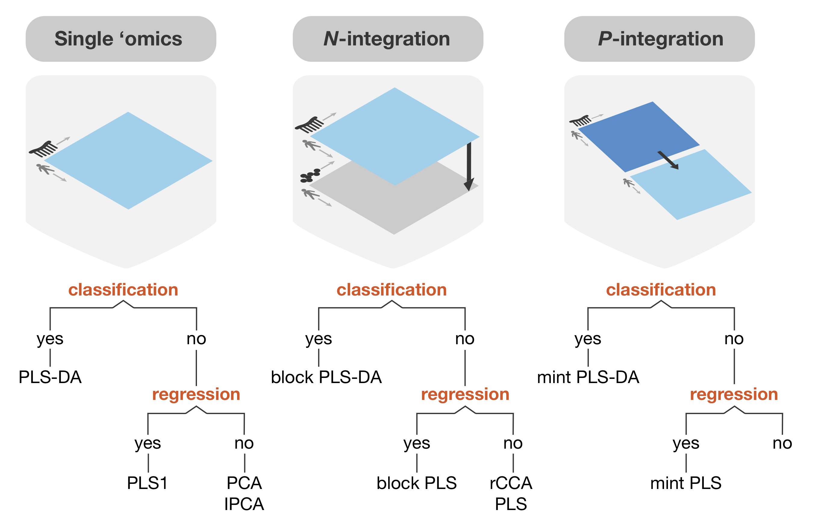
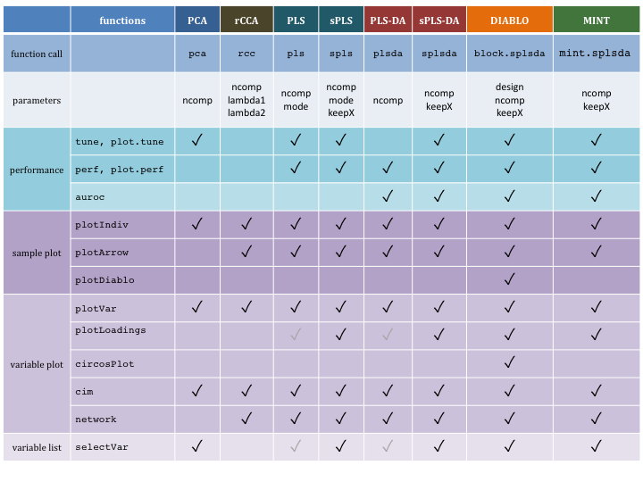

--- 
title: 'mixOmics vignette'
author:
- name: Kim-Anh Le Cao
  email: kimanh.lecao@unimelb.edu.au
  affiliation: Melbourne Integrative Genomics & School of Mathematics and Statistics, The University of Melbourne, Australia

package: mixOmics
site: bookdown::bookdown_site
output: 
  BiocStyle::html_document:
    split_bib: no
    includes:
     in_header: header.html
documentclass: book
bibliography: ["bibliography.bib"]
biblio-style: apalike
link-citations: true
github-repo: mixOmicsTeam/mixOmics
description: "Vignette for the R package mixOmics"

vignette: >
  %\VignetteIndexEntry{mixOmics}
  %\VignetteEngine{knitr::rmarkdown}
  %\VignetteEncoding{UTF-8}
---

```{r}
library(BiocParallel)
```

```{r 00-options, include=FALSE, eval=TRUE}
library(knitr)
# global options - probably better to put out.width='60%' for pdf output
knitr::opts_chunk$set(dpi = 100, echo=TRUE, warning=FALSE, message=FALSE, eval = TRUE, cache=FALSE,
                      fig.show=TRUE, fig.asp=1,fig.align='center', out.width = '75%',
                      fig.pos= "h", out.extra = '', fig.path= 'Figures/')

colorize <- function(color, x) {
  if (knitr::is_html_output()) {
    htmlcolor = "black"
    if(color == "blue"){
      htmlcolor = "#388ECC"
    }
    if(color == "orange"){
      htmlcolor = "#F68B33"
    }
    if(color == "grey"){
      htmlcolor = "#585858"
    }
    if(color == "green"){
      htmlcolor = "#009E73"
    }
    if(color == "pink"){
      htmlcolor = "#CC79A7"
    }
    if(color == "yellow"){
      htmlcolor = "#999900"
    }
    if(color == "darkred"){
      htmlcolor = "#CC0000"
    }
    sprintf("<span style='color: %s;'>%s</span>", htmlcolor, x)
  } else {
    sprintf("\\textcolor{%s}{%s}", color, x)
  }
}

# The libraries to load
library(kableExtra)
```

```{r 00-header-generation, echo=FALSE, eval=FALSE}
## run this only to re-make the logo in header.html
## Create the external file
img <- htmltools::img(src = knitr::image_uri("InputFigures/logo-mixomics.jpg"),
               alt = 'logo',
               style = 'position:absolute; top:25px; right:1%; padding:10px;z-index:200;')

htmlhead <- paste0('
<script>
document.write(\'<div class="logos">',img,'</div>\')
</script>
')

readr::write_lines(htmlhead, path = "header.html")
```


# Preamble {-}

If you are following our [online course](https://study.unimelb.edu.au/find/short-courses/mixomics-r-essentials-for-biological-data-integration/#course-specifics), the following vignette will be useful as a complementary learning tool. This vignette also covers the essential use cases of various methods in this package for the general `mixOmcis` user. The below methods will be covered:

- (s)PCA, 
- PLS1 and PLS2, 
- (s)PLS-DA,
- N-integration (multi-block sPLS-DA, aka. "DIABLO"), and 
- P-integration (multi-group sPLS-DA, aka "MINT").

As outlined in [1.3](#01:outline), this is not an exhaustive list of all the methods found within `mixOmics`. More information can be found at [our website](http://mixomics.org/) and you can ask questions via our [discourse forum](https://mixomics-users.discourse.group/).


```{r 00-analyses-diagram, eval=TRUE, echo=FALSE,fig.cap='**Different types of analyses with mixOmics** [@mixomics].The biological questions, the number of data sets to integrate, and the type of response variable, whether qualitative (classification), quantitative (regression), one (PLS1) or several (PLS) responses, all drive the choice of analytical method. All methods featured in this diagram include variable selection except rCCA. In N-integration, rCCA and PLS enable the integration of two quantitative data sets, whilst the block PLS methods (that derive from the methods from @Ten11) can integrate more than two data sets. In P-integration, our method MINT is based on multi-group PLS [@Esl14b].The following activities cover some of these methods.'}


```


``` {r 01-fig-path, echo = FALSE}
knitr::opts_chunk$set(fig.path= 'Figures/Introduction')
```

# Introduction {#01}

`mixOmics` is an R toolkit dedicated to the exploration and integration of biological data sets with a specific focus on variable selection. The package currently includes more than twenty multivariate methodologies, mostly developed by the `mixOmics` team (see some of our references in [1.2.3](#01:pubs)). Originally, all methods were designed for omics data, however, their application is not limited to biological data only. Other applications where integration is required can be considered, but mostly for the case where the predictor variables are continuous (see also [1.1](#01:datatypes)). 

In `mixOmics`, a strong focus is given to graphical representation to better translate and understand the relationships between the different data types and visualize the correlation structure at both sample and variable levels.

## Input data {#01:datatypes}
Note the data pre-processing requirements before analysing data with `mixOmics`:

- **Types of data**. Different types of biological data can be explored and integrated with `mixOmics`. Our methods can handle molecular features measured on a continuous scale (e.g. microarray, mass spectrometry-based proteomics and metabolomics) or sequenced-based count data (RNA-seq, 16S, shotgun metagenomics) that become `continuous' data after pre-processing and normalisation. 


- **Normalisation**. The package does not handle normalisation as it is platform-specific and we cover a too wide variety of data! Prior to the analysis, we assume the data sets have been normalised using appropriate normalisation methods and pre-processed when applicable. 

- **Prefiltering**. While `mixOmics` methods can handle large data sets (several tens of thousands of predictors), we recommend pre-filtering the data to less than 10K predictor variables per data set, for example by using Median Absolute Deviation [@Ten16] for RNA-seq data, by removing consistently low counts in microbiome data sets [@Lec16] or by removing near-zero variance predictors. Such step aims to lessen the computational time during the parameter tuning process.

- **Data format**. 
Our methods use matrix decomposition techniques. Therefore, the numeric data matrix or data frames have $n$ observations or samples in rows and $p$ predictors or variables (e.g. genes, proteins, OTUs) in columns.

- **Covariates**. In the current version of `mixOmics`, covariates that may confound the analysis are not included in the methods. We recommend correcting for those covariates beforehand using appropriate univariate or multivariate methods for batch effect removal. Contact us for more details as we are currently working on this aspect.


## Methods

### Some background knowledge {#01:methods}

We list here the main methodological or theoretical concepts you need to know to be able to efficiently apply `mixOmics`:

- **Individuals, observations or samples**: the experimental units on which information are collected, e.g. patients, cell lines, cells, faecal samples etc.

- **Variables, predictors**: read-out measured on each sample, e.g. gene (expression), protein or OTU (abundance), weight etc. 

- **Variance**: measures the spread of one variable. In our methods, we estimate the variance of components rather that variable read-outs. A high variance indicates that the data points are very spread out from the mean, and from one another (scattered). 

- **Covariance**: measures the strength of the relationship between two variables, i.e. whether they co-vary. A high covariance value indicates a strong relationship, e.g. weight and height in individuals frequently vary roughly in the same way; roughly, the heaviest are the tallest. A covariance value has no lower or upper bound.

- **Correlation**: a standardized version of the covariance that is bounded by -1 and 1.

- **Linear combination**: variables are combined by multiplying each of them by a coefficient and adding the results. A linear combination of height and weight could be $2 * weight - 1.5 * height$ with the coefficients $2$ and $-1.5$ assigned with weight and height respectively.

- **Component**: an artificial variable built from a linear combination of the observed variables in a given data set. Variable coefficients are optimally defined based on some statistical criterion. For example in Principal Component Analysis, the coefficients of a (principal) component are defined so as to maximise the variance of the component.

- **Loadings**: variable coefficients used to define a component.

- **Sample plot**: representation of the samples projected in a small space spanned (defined) by the components. Samples coordinates are determined by their components values or scores. 

- **Correlation circle plot**: representation of the variables in a space spanned by the components. Each variable coordinate is defined as the correlation between the original variable value and each component. A correlation circle plot enables to visualise the correlation between variables - negative or positive correlation, defined by the cosine angle between the centre of the circle and each variable point) and the contribution of each variable to each component - defined by the absolute value of the coordinate on each component. For this interpretation, data need to be centred and scaled (by default in most of our methods except PCA). For more details on this insightful graphic, see Figure 1 in [@Gon12]. 

- **Unsupervised analysis**: the method does not take into account any known sample groups and the analysis is exploratory. Examples of unsupervised methods covered in this vignette are Principal Component Analysis (PCA, Chapter [3](#03)), Projection to Latent Structures (PLS, Chapter [4](#04)), and also Canonical Correlation Analysis (CCA, not covered here but see [the website page](http://mixomics.org/methods/rcca/)).

- **Supervised analysis**: the method includes a vector indicating the class membership of each sample. The aim is to discriminate sample groups and perform sample class prediction.  Examples of supervised methods covered in this vignette are PLS Discriminant Analysis (PLS-DA, Chapter [5](#05)), DIABLO (Chapter [6](#06)) and also MINT (Chapter [7](#07)).

If the above descriptions were not comprehensive enough and you have some more questions, feel free to explore the [glossary](http://mixomics.org/faq/glossary/) on our website.


### Overview {#01:overview}

Here is an overview of the most widely used methods in `mixOmics` that will be further detailed in this vignette, with the exception of rCCA. We depict them along with the type of data set they can handle. 


<p style="text-align: center">FIGURE 1: An overview of what quantity and type of dataset each method within mixOmics requires. Thin columns represent a single variable, while the larger blocks represent datasets of multiple samples and variables.</p>


```{r 01-methods-diagram, echo=FALSE, fig.cap="List of methods in mixOmics, sparse indicates methods that perform variable selection", out.width='100%', fig.align='center'}
knitr::include_graphics("InputFigures/Methods.png")
```

```{r 01-cheatsheet, echo=FALSE, fig.cap="Main functions and parameters of each method", out.width= '100%', fig.align='center'}

```


### Key publications {#01:pubs}

The methods implemented in `mixOmics` are described in detail in the following publications. A more extensive list can be found at this [link](http://mixomics.org/a-propos/publications/).

- **Overview and recent integrative methods**: Rohart F.,  Gautier, B, Singh, A, Le Cao, K. A. mixOmics: an [R package for 'omics feature selection and multiple data integration](http://journals.plos.org/ploscompbiol/article?id=10.1371/journal.pcbi.1005752). *PLoS Comput Biol* 13(11): e1005752.

- **Graphical outputs for integrative methods**: [@Gon12] Gonzalez I., Le Cao K.-A., Davis, M.D. and Dejean S. (2012) [Insightful graphical outputs to explore relationships between two omics data sets](https://biodatamining.biomedcentral.com/articles/10.1186/1756-0381-5-19). *BioData Mining* 5:19.

- **DIABLO**: Singh A, Gautier B, Shannon C, Vacher M, Rohart F, Tebbutt S, K-A. Le Cao. [DIABLO - multi-omics data integration for biomarker discovery](https://www.biorxiv.org/content/early/2018/03/20/067611).

- **sparse PLS**: Le Cao K.-A., Martin P.G.P, Robert-Granie C. and Besse, P. (2009) [Sparse Canonical Methods for Biological Data Integration: application to a cross-platform study](http://www.biomedcentral.com/1471-2105/10/34/). *BMC Bioinformatics*, 10:34.

- **sparse PLS-DA**: Le Cao K.-A., Boitard S. and Besse P. (2011) [Sparse PLS Discriminant Analysis: biologically relevant feature selection and graphical displays for multiclass problems]( https://bmcbioinformatics.biomedcentral.com/articles/10.1186/1471-2105-12-253). *BMC Bioinformatics*, 22:253.

- **Multilevel approach for repeated measurements**: Liquet B, Le Cao K-A, Hocini H, Thiebaut R (2012). [A novel approach for biomarker selection and the integration of repeated measures experiments from two assays](https://bmcbioinformatics.biomedcentral.com/articles/10.1186/1471-2105-13-325). *BMC Bioinformatics*, 13:325

- **sPLS-DA for microbiome data**: Le Cao K-A$^*$, Costello ME $^*$, Lakis VA , Bartolo F, Chua XY, Brazeilles R and Rondeau P. (2016) [MixMC: Multivariate insights into Microbial Communities](http://journals.plos.org/plosone/article?id=10.1371/journal.pone.0160169).PLoS ONE 11(8): e0160169


## Outline of this Vignette {#01:outline}

- **[Chapter 2](#02)**: details some practical aspects to get started
- **[Chapter 3](#03)**: Principal Components Analysis (PCA)
- **[Chapter 4](#04)**: Projection to Latent Structures (PLS)
- **[Chapter 5](#05)**: Projection to Latent Structure - Discriminant Analysis (PLS-DA)
- **[Chapter 6](#06)**: Integrative analysis for multiple data sets, across samples (namely DIABLO)
- **[Chapter 7](#07)**: Integrative analysis for multiple data, across features (namely MINT)

Each methods chapter has the following outline:

1. Type of biological question to be answered
2. Brief description of an illustrative data set
3. Principle of the method
4. Quick start of the method with the main functions and arguments 
5. To go further: customized plots, additional graphical outputs, and tuning parameters
6. FAQ

## Other methods not covered in this vignette

Other methods not covered in this document are described on our website and the following references:

- [regularised Canonical Correlation Analysis](http://www.mixOmics.org), see the **Methods** and **Case study** tabs, and [@Gon08] that describes CCA for large data sets.

- [Microbiome (16S, shotgun metagenomics) data analysis](http://www.mixOmics.org/mixmc), see also [@Lec16] and [kernel integration for microbiome data](http://mixomics.org/mixkernel). The latter is in collaboration with Drs J Mariette and Nathalie Villa-Vialaneix (INRA Toulouse, France), an example is provided for the Tara ocean metagenomics and environmental data.


``` {r 02-fig-path, echo = FALSE}
knitr::opts_chunk$set(fig.path= 'Figures/Getting-Started')
```

# Let's get started {#02}

## Installation {#02:install}

First, download the latest \texttt{mixOmics} version from Bioconductor:

```{r 02-install-bioc, eval = FALSE}
if (!requireNamespace("BiocManager", quietly = TRUE))
    install.packages("BiocManager")
 BiocManager::install("mixOmics")
```

Alternatively, you can install the latest GitHub version of the package:

```{r 02-install-github, eval = FALSE}
BiocManager::install("mixOmicsTeam/mixOmics")
```

The `mixOmics` package should directly import the following packages:
`igraph, rgl, ellipse, corpcor, RColorBrewer, plyr, parallel, dplyr, tidyr, reshape2, methods, matrixStats, rARPACK, gridExtra`.
**For Apple mac users:** if you are unable to install the imported package `rgl`, you will need to install the [XQuartz software](https://www.xquartz.org) first.

## Load the package {#02:load-data}

```{r 02-load, message=FALSE}
library(mixOmics)
```

Check that there is no error when loading the package, especially for the `rgl` library (see above).

## Upload data
The examples we give in this vignette use data that are already part of the package. To upload your own data, check first that your working directory is set, then read your data from a  `.txt` or `.csv` format, either by using **File > Import Dataset** in RStudio or via one of these command lines:

```{r 02-read-data, eval = FALSE}
# from csv file
data <- read.csv("your_data.csv", row.names = 1, header = TRUE)

# from txt file
data <- read.table("your_data.txt", header = TRUE)
```

For more details about the arguments used to modify those functions, type `?read.csv` or `?read.table` in the R console.

## Quick start in `mixOmics` {#02:quick-start}

Each analysis should follow this workflow:

1. Run the method
2. Graphical representation of the samples
3. Graphical representation of the variables

Then use your critical thinking and additional functions and visual tools to make sense of your data! (some of which are listed in [1.2.2](#01:overview)) and will be described in the next Chapters.

For instance, for Principal Components Analysis, we first load the data:

```{r 02-load-nutrimouse}
data(nutrimouse)
X <- nutrimouse$gene
```


Then use the following steps:

```{r 02-pca-nutrimouse}
MyResult.pca <- pca(X)  # 1 Run the method
plotIndiv(MyResult.pca) # 2 Plot the samples
plotVar(MyResult.pca)   # 3 Plot the variables
```


This is only a first quick-start, there will be many avenues you can take to deepen your exploratory and integrative analyses. The package proposes several methods to perform variable, or feature selection to identify the relevant information from rather large omics data sets. The sparse methods are listed in the Table in [1.2.2](#01:overview).

Following our example here, sparse PCA can be applied to select the top 5 variables contributing to each of the two components in PCA. The user specifies the number of variables to selected on each component, for example, here 5 variables are selected on each of the first two components (`keepX=c(5,5)`): 

```{r 02-spca-nutrimouse}
MyResult.spca <- spca(X, keepX=c(5,5)) # 1 Run the method
plotIndiv(MyResult.spca)               # 2 Plot the samples
plotVar(MyResult.spca)                 # 3 Plot the variables
```

You can see know that we have considerably reduced the number of genes in the `plotVar` correlation circle plot.


Do not stop here! We are not done yet. You can enhance your analyses with the following:

- Have a look at our manual and each of the functions and their examples, e.g. `?pca`, `?plotIndiv`, `?sPCA`, ... 

- Run the examples from the help file using the `example` function: `example(pca)`, `example(plotIndiv)`, ...

- Have a look at our [website](http://www.mixomics.org) that features many tutorials and case studies,

- Keep reading this vignette, this is *just the beginning!*


``` {r 03-fig-path, echo = FALSE}
knitr::opts_chunk$set(fig.path= 'Figures/PCA/')
```


# PCA on the `multidrug` study {#03}

To illustrate PCA and is variants, we will analyse the `multidrug` case study available in the package. This pharmacogenomic study investigates the patterns of drug activity in cancer cell lines [@Sza04]. These cell lines come from the [NCI-60 Human Tumor Cell Lines](https://dtp.cancer.gov/discovery_development/nci-60/) established by the Developmental Therapeutics Program of the National Cancer Institute (NCI) to screen for the toxicity of chemical compound repositories in diverse cancer cell lines. NCI-60 includes cell lines derived from cancers of colorectal (7 cell lines), renal (8), ovarian (6), breast (8), prostate (2), lung (9) and central nervous system origin (6), as well as leukemia (6) and melanoma (8).

Two separate data sets (representing two types of measurements) on the same NCI-60 cancer cell lines are available in `multidrug` (see also `?multidrug`):

- `$ABC.trans`: Contains the expression of 48 human ABC transporters measured by quantitative real-time PCR (RT-PCR) for each cell line.

- `$compound`: Contains the activity of 1,429 drugs expressed as GI50, which is the drug concentration that induces 50\% inhibition of cellular growth for the tested cell line.

Additional information will also be used in the outputs:

- `$comp.name`: The names of the 1,429 compounds.

- `$cell.line`: Information on the cell line names (`$Sample`) and the  cell line types (`$Class`).

In this activity, we illustrate PCA performed on the human ABC transporters `ABC.trans`, and sparse PCA on the compound data `compound`. 

## Load the data {#03:load-data}

The input data matrix $\boldsymbol{X}$ is of size $N$ samples in rows and $P$ variables (e.g. genes) in columns. We start with the `ABC.trans` data.

```{r 03-load-multidrug, message=FALSE, warning=FALSE}
library(mixOmics)
data(multidrug)
X <- multidrug$ABC.trans
dim(X) # Check dimensions of data
```


## Example: PCA {#03:pca}


### Choose the number of components {#03:pca-ncomp}

Contrary to the minimal code example, here we choose to also scale the variables for the reasons detailed earlier. The function `tune.pca()` calculates the cumulative proportion of explained variance for a large number of principal components (here we set `ncomp = 10`). A screeplot of the proportion of explained variance relative to the total amount of variance in the data for each principal component is output (Fig. \@ref(fig:03-screeplot)):

```{r 03-screeplot, fig.cap='(ref:03-screeplot)'}
tune.pca.multi <- tune.pca(X, ncomp = 10, scale = TRUE)
plot(tune.pca.multi)
# tune.pca.multidrug$cum.var       # Outputs cumulative proportion of variance
```

(ref:03-screeplot) **Screeplot from the PCA performed on the `ABC.trans` data**: Amount of explained variance for each principal component on the ABC transporter data.

From the numerical output (not shown here), we observe that the first two principal components explain `r round(tune.pca.multi$cum.var[2]*100, 2)`% of the total variance, and the first three principal components explain `r round(tune.pca.multi$cum.var[3]*100, 2)`% of the total variance. The rule of thumb for choosing the number of components is not so much to set a hard threshold based on the cumulative proportion of explained variance (as this is data-dependent), but to observe when a drop, or elbow, appears on the screeplot. The elbow indicates that the remaining variance is spread over many principal components and is not relevant in obtaining a low dimensional 'snapshot' of the data. This is an empirical way of choosing the number of principal components to retain in the analysis. In this specific example we could choose between 2 to 3 components for the final PCA, however these criteria are highly subjective and the reader must keep in mind that visualisation becomes difficult above three dimensions.

### PCA with fewer components {#03:pca-final}

Based on the preliminary analysis above, we run a PCA with three components. Here we show additional input, such as whether to center or scale the variables.

```{r 03-pca-final, echo=TRUE, message=FALSE}
final.pca.multi <- pca(X, ncomp = 3, center = TRUE, scale = TRUE)
# final.pca.multi  # Lists possible outputs
```

The output is similar to the tuning step above. Here the total variance in the data is:

```{r}
final.pca.multi$var.tot
```

By summing the variance explained from all possible components, we would achieve the same amount of explained variance. The proportion of explained variance per component is:

```{r}
final.pca.multi$prop_expl_var$X
```

The cumulative proportion of variance explained can also be extracted (as displayed in Figure \@ref(fig:03-screeplot)):
```{r}
final.pca.multi$cum.var
```

### Identify the informative variables {#03:pca-vars}

To calculate components, we use the variable coefficient weights indicated in the loading vectors. Therefore, the absolute value of the coefficients in the loading vectors inform us about the importance of each variable in contributing to the definition of each component. We can extract this information through the `selectVar()` function which ranks the most important variables in decreasing order according to their absolute loading weight value for each principal component. 

```{r 03-pca-vars, echo=TRUE, message=FALSE}
# Top variables on the first component only:
head(selectVar(final.pca.multi, comp = 1)$value)
```

Note: 

- *Here the variables are not selected (all are included), but ranked according to their importance in defining each component.*

### Sample plots {#03:pca-sample-plot}

We project the samples into the space spanned by the principal components to visualise how the samples cluster and assess for biological or technical variation in the data. We colour the samples according to the cell line information available in `multidrug$cell.line$Class` by specifying the argument `group` (Fig. \@ref(fig:03-pca-sample-plot)).

```{r 03-pca-sample-plot, fig.cap='(ref:03-pca-sample-plot)'}
plotIndiv(final.pca.multi,
          comp = c(1, 2),   # Specify components to plot
          ind.names = TRUE, # Show row names of samples
          group = multidrug$cell.line$Class,
          title = 'ABC transporters, PCA comp 1 - 2',
          legend = TRUE, legend.title = 'Cell line')
```

(ref:03-pca-sample-plot) **Sample plot from the PCA performed on the `ABC.trans` data**. Samples are projected into the space spanned by the first two principal components, and coloured according to cell line type. Numbers indicate the rownames of the data.

Because we have run PCA on three components, we can examine the third component, either by plotting the samples onto the principal components 1 and 3 (PC1 and PC3) in the code above (`comp = c(1, 3)`) or by using the 3D interactive plot (code shown below). The addition of the third principal component only seems to highlight a potential outlier (sample 8, not shown). Potentially, this sample could be removed from the analysis, or, noted when doing further downstream analysis. The removal of outliers should be exercised with great caution and backed up with several other types of analyses (e.g. clustering) or graphical outputs (e.g. boxplots, heatmaps, etc).

```{r, eval = FALSE}
# Interactive 3D plot will load the rgl library.
plotIndiv(final.pca.multi, style = '3d',
           group = multidrug$cell.line$Class,
          title = 'ABC transporters, PCA comp 1 - 3')
```

These plots suggest that the largest source of variation explained by the first two components can be attributed to the `r colorize("pink", "melanoma")` cell line, while the third component highlights a single outlier sample. Hence, the interpretation of the following outputs should primarily focus on the first two components.

Note: 

- *Had we not scaled the data, the separation of the melanoma cell lines would have been more obvious with the addition of the third component, while PC1 and PC2 would have also highlighted the sample outliers 4 and 8. Thus, centering and scaling are important steps to take into account in PCA.*

### Variable plot: correlation circle plot {#03:pca-variable-plot}

Correlation circle plots indicate the contribution of each variable to each component using the `plotVar()` function, as well as the correlation between variables (indicated by a 'cluster' of variables). Note that to interpret the latter, the variables need to be centered and scaled in PCA:

```{r, eval = FALSE}
plotVar(final.pca.multi, comp = c(1, 2),
        var.names = TRUE,
        cex = 3,         # To change the font size
        # cutoff = 0.5,  # For further cutoff
        title = 'Multidrug transporter, PCA comp 1 - 2')
```        

```{r 03-pca-variable-plot, echo = FALSE, fig.cap='(ref:03-pca-variable-plot)'}
col.var <- c(rep(color.mixo(1), ncol(X)))
names(col.var) = colnames(X)
col.var[c('ABCE1', 'ABCB8')] = color.mixo(2)
col.var[c('ABCA8')] = color.mixo(4)
col.var[c('ABCC2')] = color.mixo(5)
col.var[c('ABCC12', 'ABCD2')] = color.mixo(6)

plotVar(final.pca.multi, comp = c(1, 2),
        var.names = TRUE,
        col = list(col.var),
        cex = 3,
        title = 'Multidrug transporter, PCA comp 1 - 2')
```

(ref:03-pca-variable-plot) **Correlation Circle plot from the PCA performed on the `ABC.trans` data**. The plot shows groups of transporters that are highly correlated, and also contribute to PC1 - near the big circle on the right hand side of the plot (transporters grouped with those in `r colorize("orange", "orange")`), or PC1 and PC2 - top left and top bottom corner of the plot, transporters grouped with those in `r colorize("pink", "pink")` and `r colorize("yellow", "yellow")`.

The plot in Figure \@ref(fig:03-pca-variable-plot) highlights a group of ABC transporters that contribute to PC1: `r colorize("orange", "ABCE1")`, and to some extent the group clustered with `r colorize("orange", "ABCB8")` that contributes positively to PC1, while `r colorize("green", "ABCA8")` contributes negatively. We also observe a group of transporters that contribute to both PC1 and PC2: the group clustered with `r colorize("pink", "ABCC2")` contributes negatively both to PC1 and PC2, and a cluster of `r colorize("yellow", "ABCC12")` and `r colorize("yellow", "ABCD2")` that contributes negatively to PC1 and positively to PC2. We observe that several transporters are inside the small circle. However, examining the third component (argument `comp = c(1, 3)`) does not appear to reveal further transporters that contribute to this third component. The additional argument `cutoff = 0.5` could further simplify this plot.

### Biplot: samples and variables {#03:pca-biplot}

A biplot allows us to display both samples and variables simultaneously to further understand their relationships. Samples are displayed as dots while variables are displayed at the tips of the arrows. Similar to correlation circle plots, data must be centered and scaled to interpret the correlation between variables (as a cosine angle between variable arrows).

```{r 03-pca-biplot, fig.cap='(ref:03-pca-biplot)'}
biplot(final.pca.multi, group = multidrug$cell.line$Class, 
       legend.title = 'Cell line')
```

(ref:03-pca-biplot) **Biplot from the PCA performed on the `ABS.trans` data**. The plot highlights which transporter expression levels may be related to specific cell lines, such as `r colorize("pink", "melanoma")`.

The biplot in Figure \@ref(fig:03-pca-biplot) shows that the `r colorize("pink", "melanoma")` cell lines seem to be characterised by a subset of transporters such as the cluster around `r colorize("pink", "ABCC2")` as highlighted previously  in Figure \@ref(fig:03-pca-variable-plot). Further examination of the data, such as boxplots (as shown in Fig. \@ref(fig:03-pca-boxplot)), can further elucidate the transporter expression levels for these specific samples.

```{r 03-pca-boxplot, fig.cap='(ref:03-pca-boxplot)'}
ABCC2.scale <- scale(X[, 'ABCC2'], center = TRUE, scale = TRUE)

boxplot(ABCC2.scale ~
        multidrug$cell.line$Class, col = color.mixo(1:9),
        xlab = 'Cell lines', ylab = 'Expression levels, scaled',
        par(cex.axis = 0.5), # Font size
        main = 'ABCC2 transporter')
```

(ref:03-pca-boxplot) **Boxplots of the transporter `r colorize("pink", "ABCC2")`** identified from the PCA correlation circle plot (Fig. \@ref(fig:03-pca-variable-plot)) and the biplot (Fig. \@ref(fig:03-pca-biplot)) show the level of `r colorize("pink", "ABCC2")` expression related to cell line types. The expression level of `r colorize("pink", "ABCC2")` was centered and scaled in the PCA, but similar patterns are also observed in the original data.  

## Example: sparse PCA {#03:spca}

In the `ABC.trans` data, there is only one missing value. Missing values can be handled by sPCA via the NIPALS algorithm . However, if the number of missing values is large, we recommend imputing them with NIPALS, as we describe in our website in www.mixOmics.org.

### Choose the number of variables to select {#03:spca-vars}

First, we must decide on the number of components to evaluate. The previous tuning step indicated that `ncomp = 3` was sufficient to explain most of the variation in the data, which is the value we choose in this example. We then set up a grid of `keepX` values to test, which can be thin or coarse depending on the total number of variables. We set up the grid to be thin at the start, and coarse as the number of variables increases. The `ABC.trans` data includes a sufficient number of samples to perform repeated 5-fold cross-validation to define the number of folds and repeats (leave-one-out CV is also possible if the number of samples $N$ is small by specifying `folds = ` $N$). The computation may take a while if you are not using parallelisation (see additional parameters in `tune.spca()`), here we use a small number of repeats for illustrative purposes. We then plot the output of the tuning function.


```{r 03-spca-tuning, fig.cap='(ref:03-spca-tuning)'}
grid.keepX <- c(seq(5, 30, 5))
# grid.keepX  # To see the grid

set.seed(30) # For reproducibility with this handbook, remove otherwise
tune.spca.result <- tune.spca(X, ncomp = 3, 
                              folds = 5, 
                              test.keepX = grid.keepX, nrepeat = 10) 

# Consider adding up to 50 repeats for more stable results
tune.spca.result$choice.keepX

plot(tune.spca.result)
```

(ref:03-spca-tuning) **Tuning the number of variables to select with sPCA on the `ABC.trans` data**. For a grid of number of variables to select indicated on the x-axis, the average correlation between predicted and actual components based on cross-validation is calculated and shown on the y-axis for each component. The optimal number of variables to select per component is assessed via one-sided $t-$tests and is indicated with a diamond. 

The tuning function outputs the averaged correlation between predicted and actual components per `keepX` value for each component. It indicates the optimal number of variables to select for which the averaged correlation is maximised on each component. Figure \@ref(fig:03-spca-tuning) shows that this is achieved when selecting `r tune.spca.result$choice.keepX[1]` transporters on the first component, and `r tune.spca.result$choice.keepX[2]` on the second. Given the drop in values in the averaged correlations for the third component, we decide to only retain two components. 

Note: 

- *If the tuning results suggest a large number of variables to select that is close to the total number of variables, we can arbitrarily choose a much smaller selection size.*

### Final sparse PCA {#03:spca-final}

Based on the tuning above, we perform the final sPCA where the number of variables to select on each component is specified with the argument `keepX`. Arbitrary values can also be input if you would like to skip the tuning step for more exploratory analyses:

```{r 03-spca-final}
# By default center = TRUE, scale = TRUE
keepX.select <- tune.spca.result$choice.keepX[1:2]

final.spca.multi <- spca(X, ncomp = 2, keepX = keepX.select)

# Proportion of explained variance:
final.spca.multi$prop_expl_var$X
```

 Overall when considering two components, we lose approximately `r round(final.pca.multi$cum.var[2] - cumsum(final.spca.multi$prop_expl_var$X)[2],3) * 100` % of explained variance compared to a full PCA, but the aim of this analysis is to identify key transporters driving the variation in the data, as we show below.

### Sample and variable plots {#03:spca-plots}

We first examine the sPCA sample plot:

```{r 03-spca-sample-plot, fig.cap='(ref:03-spca-sample-plot)'}
plotIndiv(final.spca.multi,
          comp = c(1, 2),   # Specify components to plot
          ind.names = TRUE, # Show row names of samples
          group = multidrug$cell.line$Class,
          title = 'ABC transporters, sPCA comp 1 - 2',
          legend = TRUE, legend.title = 'Cell line')
```

(ref:03-spca-sample-plot) **Sample plot from the sPCA performed on the `ABC.trans` data**. Samples are projected onto the space spanned by the first two sparse principal components that are calculated based on a subset of selected variables. Samples are coloured by cell line type and numbers indicate the sample IDs.

In Figure \@ref(fig:03-spca-sample-plot), component 2 in sPCA shows clearer separation of the `r colorize("pink", "melanoma")` samples compared to the full PCA. Component 1 is similar to the full PCA. Overall, this sample plot shows that little information is lost compared to a full PCA.


A biplot can also be plotted that only shows the selected transporters (Figure \@ref(fig:03-spca-biplot)):

```{r 03-spca-biplot, fig.cap='(ref:03-spca-biplot)'}
biplot(final.spca.multi, group = multidrug$cell.line$Class, 
       legend =FALSE)
```

(ref:03-spca-biplot) **Biplot from the sPCA performed on the `ABS.trans` data after variable selection**. The plot highlights in more detail which transporter expression levels may be related to specific cell lines, such as melanoma, compared to a classical PCA.


The correlation circle plot highlights variables that contribute to component 1 and component 2 (Fig. \@ref(fig:03-spca-variable-plot)): 

```{r, eval = FALSE}
plotVar(final.spca.multi, comp = c(1, 2), var.names = TRUE, 
        cex = 3, # To change the font size 
        title = 'Multidrug transporter, sPCA comp 1 - 2')
```

```{r 03-spca-variable-plot, fig.cap='(ref:03-spca-variable-plot)', echo = FALSE}
col.var <- c(rep(color.mixo(1), ncol(X)))
names(col.var) <- colnames(X)
col.var[c("ABCA9", "ABCB5", "ABCC2","ABCD1")] <- color.mixo(4)

plotVar(final.spca.multi, comp = c(1, 2), var.names = TRUE,
        col = list(col.var), cex = 3, # To change the font size
        title = 'Multidrug transporter, sPCA comp 1 - 2')
```

(ref:03-spca-variable-plot) **Correlation Circle plot from the sPCA performed on the `ABC.trans` data**. Only the transporters selected by the sPCA are shown on this plot. Transporters coloured in `r colorize("green", "green")` are discussed in the text.

The transporters selected by sPCA are amongst the most important ones in PCA. Those coloured in green in  Figure \@ref(fig:03-pca-variable-plot) (`r colorize("green", "ABCA9, ABCB5, ABCC2")` and `r colorize("green", "ABCD1")`) show an example of variables that contribute positively to component 2, but with a larger weight than in PCA. Thus, they appear as a clearer cluster in the top part of the correlation circle plot compared to PCA. As shown in the biplot in Figure \@ref(fig:03-spca-biplot), they contribute in explaining the variation in the `r colorize("pink", "melanoma")` samples.


We can extract the variable names and their positive or negative contribution to a given component (here 2), using the `selectVar()` function:

```{r echo=TRUE, message=FALSE}
# On the first component, just a head
head(selectVar(final.spca.multi, comp = 2)$value)
```

The loading weights can also be visualised with `plotLoading()`, where variables are ranked from the least important (top) to the most important (bottom) in Figure \@ref(fig:03-spca-loading-plot)). Here on component 2:

```{r 03-spca-loading-plot, fig.cap='(ref:03-spca-loading-plot)',}
plotLoadings(final.spca.multi, comp = 2)
```

(ref:03-spca-loading-plot) **sPCA loading plot of the `ABS.trans` data for component 2**. Only the transporters selected by sPCA on component 2 are shown, and are ranked from least important (top) to most important. Bar length indicates the loading weight in PC2.


``` {r 04-fig-path, echo = FALSE}
knitr::opts_chunk$set(fig.path= 'Figures/PLS/')
```


# PLS on the liver toxicity study {#04}

The data come from a liver toxicity study in which 64 male rats were exposed to non-toxic (50 or 150 mg/kg), moderately toxic (1500 mg/kg) or severely toxic (2000 mg/kg) doses of acetaminophen (paracetamol)  [@Bus07]. Necropsy was performed at 6, 18, 24 and 48 hours after exposure and the mRNA was extracted from the liver. Ten clinical measurements of markers for liver injury are available for each subject. The microarray data contain expression levels of 3,116 genes. The data were normalised and preprocessed by @Bus07.

`liver toxicity` contains the following:

- `$gene`: A data frame with 64 rows (rats) and 3116 columns (gene expression levels),
- `$clinic`: A data frame with 64 rows (same rats) and 10 columns (10 clinical variables),
- `$treatment`: A data frame with 64 rows and 4 columns, describe the different treatments, such as doses of acetaminophen and times of necropsy.

We can analyse these two data sets (genes and clinical measurements) using sPLS1, then sPLS2 with a regression mode to explain or predict the clinical variables with respect to the gene expression levels.

## Load the data {#04:load-data}

```{r 04-load-data2, echo = FALSE}
devtools::install_github("mixOmicsTeam/mixOmics")
data(liver.toxicity)
X <- liver.toxicity$gene
Y <- liver.toxicity$clinic
```

```{r 04-load-data, eval = FALSE}
library(mixOmics)
data(liver.toxicity)
X <- liver.toxicity$gene
Y <- liver.toxicity$clinic
```


As we have discussed previously for integrative analysis, we need to ensure that the samples in the two data sets are in the same order, or matching, as we are performing data integration:

```{r}
head(data.frame(rownames(X), rownames(Y)))
```


## Example: sPLS1 regression {#04:spls1}

We first start with a simple case scenario where we wish to explain one $\boldsymbol Y$ variable with a combination of selected $\boldsymbol X$ variables (transcripts). We choose the following clinical measurement which we denote as the $\boldsymbol y$ single response variable:

```{r}
y <- liver.toxicity$clinic[, "ALB.g.dL."]
```


### Number of dimensions using the $Q^2$ criterion {#04:spls1-ncomp}

Defining the 'best' number of dimensions to explain the data requires we first launch a PLS1 model with a large number of components. Some of the outputs from the PLS1 object are then retrieved in the `perf()` function to calculate the $Q^2$ criterion using repeated 10-fold cross-validation.

```{r  04-spls1-ncomp, fig.cap='(ref:04-spls1-ncomp)'}
tune.pls1.liver <- pls(X = X, Y = y, ncomp = 4, mode = 'regression')
set.seed(33)  # For reproducibility with this handbook, remove otherwise
Q2.pls1.liver <- perf(tune.pls1.liver, validation = 'Mfold', 
                      folds = 10, nrepeat = 5)
plot(Q2.pls1.liver, criterion = 'Q2')
```

(ref:04-spls1-ncomp) **$Q^2$ criterion to choose the number of components in PLS1**. For each dimension added to the PLS model, the $Q^2$ value is shown. The horizontal line of 0.0975 indicates the threshold below which adding a dimension may not be beneficial to improve accuracy in PLS.

The plot in Figure \@ref(fig:04-spls1-ncomp) shows that the $Q^2$ value varies with the number of dimensions added to PLS1, with a decrease to negative values from 2 dimensions. Based on this plot we would choose only one dimension, but we will still add a second dimension for the graphical outputs. 

Note:

- *One dimension is not unusual given that we only include one $\boldsymbol y$ variable in PLS1.*

### Number of variables to select in $\boldsymbol X$ {#04:spls1-tuning}

We now set a grid of values  - thin at the start, but also restricted to a small number of genes for a parsimonious model, which we will test for each of the two components in the `tune.spls()` function, using the MAE criterion.

```{r 04-spls1-tuning, fig.cap='(ref:04-spls1-tuning)'}
# Set up a grid of values: 
list.keepX <- c(5:10, seq(15, 50, 5))     

# list.keepX  # Inspect the keepX grid
set.seed(33)  # For reproducibility with this handbook, remove otherwise
tune.spls1.MAE <- tune.spls(X, y, ncomp= 2, 
                            test.keepX = list.keepX, 
                            validation = 'Mfold', 
                            folds = 10,
                            nrepeat = 5, 
                            progressBar = FALSE, 
                            measure = 'MAE')
plot(tune.spls1.MAE)
```

(ref:04-spls1-tuning) **Mean Absolute Error criterion to choose the number of variables to select in PLS1**, using repeated CV times for a grid of variables to select. The MAE increases with the addition of a second dimension `r colorize("orange", "comp 1 to 2")`, suggesting that only one dimension is sufficient. The optimal `keepX` is indicated with a diamond.

Figure \@ref(fig:04-spls1-tuning) confirms that one dimension is sufficient to reach minimal MAE. Based on the `tune.spls()` function we extract the final parameters:

```{r}
choice.ncomp <- tune.spls1.MAE$choice.ncomp$ncomp
# Optimal number of variables to select in X based on the MAE criterion
# We stop at choice.ncomp
choice.keepX <- tune.spls1.MAE$choice.keepX[1:choice.ncomp]  

choice.ncomp
choice.keepX
```

Note:

- *Other criterion could have been used and may bring different results. For example, when using `measure = 'MSE`, the optimal `keepX` was rather unstable, and is often smaller than when using the MAE criterion. As we have highlighted before, there is some back and forth in the analyses to choose the criterion and parameters that best fit our biological question and interpretation.*

###  Final sPLS1 model  {#04:spls1-final}

Here is our final model with the tuned parameters:
```{r 04-spls1-final}
spls1.liver <- spls(X, y, ncomp = choice.ncomp, keepX = choice.keepX, 
                    mode = "regression")
```

The list of genes selected on component 1 can be extracted with the command line (not output here):
```{r, eval = FALSE}
selectVar(spls1.liver, comp = 1)$X$name
```

We can compare the amount of explained variance for the $\boldsymbol X$ data set based on the sPLS1 (on `r choice.ncomp` component) versus PLS1 (that was run on 4 components during the tuning step):

```{r}
spls1.liver$prop_expl_var$X
tune.pls1.liver$prop_expl_var$X
```

The amount of explained variance in $\boldsymbol X$ is lower in sPLS1 than PLS1 for the first component. However, we will see in this case study that the Mean Squared Error Prediction is also lower (better) in sPLS1 compared to PLS1.

### Sample plots  {#04:spls1-sample-plots}

For further graphical outputs, we need to add a second dimension in the model, which can include the same number of `keepX` variables as in the first dimension. However, the interpretation should primarily focus on the first dimension. In Figure \@ref(fig:04-spls1-sample-plot) we colour the samples according to the time of treatment and add symbols to represent the treatment dose. Recall however that such information was not included in the sPLS1 analysis. 

```{r 04-spls1-sample-plot, fig.cap='(ref:04-spls1-sample-plot)', message=FALSE}
spls1.liver.c2 <- spls(X, y, ncomp = 2, keepX = c(rep(choice.keepX, 2)), 
                   mode = "regression")

plotIndiv(spls1.liver.c2,
          group = liver.toxicity$treatment$Time.Group,
          pch = as.factor(liver.toxicity$treatment$Dose.Group),
          legend = TRUE, legend.title = 'Time', legend.title.pch = 'Dose')

```

(ref:04-spls1-sample-plot) **Sample plot from the PLS1 performed on the `liver.toxicity` data with two dimensions**. Components associated to each data set (or block) are shown. Focusing only on the projection of the sample on the first component shows that the genes selected in $\boldsymbol X$ tend to explain the `r colorize("grey", "48h")` length of treatment vs the earlier time points. This is somewhat in agreement with the levels of the $\boldsymbol y$ variable. However, more insight can be obtained by plotting the first components only, as shown in Figure \@ref(fig:04-spls1-sample-plot2).

The alternative is to plot the component associated to the $\boldsymbol X$ data set (here corresponding to a linear combination of the selected genes) vs. the component associated to the $\boldsymbol y$ variable (corresponding to the scaled $\boldsymbol y$ variable in PLS1 with one dimension), or calculate the correlation between both components:

```{r 04-spls1-sample-plot2, fig.cap='(ref:04-spls1-sample-plot2)'}
# Define factors for colours matching plotIndiv above
time.liver <- factor(liver.toxicity$treatment$Time.Group, 
                     levels = c('18', '24', '48', '6'))
dose.liver <- factor(liver.toxicity$treatment$Dose.Group, 
                     levels = c('50', '150', '1500', '2000'))
# Set up colours and symbols
col.liver <- color.mixo(time.liver)
pch.liver <- as.numeric(dose.liver)

plot(spls1.liver$variates$X, spls1.liver$variates$Y,
     xlab = 'X component', ylab = 'y component / scaled y',
     col = col.liver, pch = pch.liver)
legend('topleft', col = color.mixo(1:4), legend = levels(time.liver),
       lty = 1, title = 'Time')
legend('bottomright', legend = levels(dose.liver), pch = 1:4,
       title = 'Dose')

cor(spls1.liver$variates$X, spls1.liver$variates$Y)
```

(ref:04-spls1-sample-plot2) **Sample plot from the sPLS1 performed on the `liver.toxicity` data on one dimension**. A reduced representation of the `r choice.keepX` genes selected and combined in the $\boldsymbol X$ component on the $x-$axis with respect to the $\boldsymbol y$ component value (equivalent to the scaled values of $\boldsymbol y$) on the $y-$axis. We observe a separation between the high doses 1500 and 2000 mg/kg (symbols $+$ and $\times$) at `r colorize("grey", "48h")` and `r colorize("blue", "18h")` while low and medium doses cluster in the middle of the plot. High doses for `r colorize("green", "6h")` and `r colorize("blue", "18h")` have high scores for both components. 

Figure \@ref(fig:04-spls1-sample-plot2) is a reduced representation of a multivariate regression with PLS1. It shows that PLS1 effectively models a linear relationship between $\boldsymbol y$ and the combination of the `r choice.keepX` genes selected in $\boldsymbol X$.

### Performance assessment of sPLS1 {#04:spls1-perf}

The performance of the final model can be assessed with the `perf()` function, using repeated cross-validation (CV). Because a single performance value has little meaning, we propose to compare the performances of a full PLS1 model (with no variable selection) with our sPLS1 model based on the MSEP (other criteria can be used):


```{r 04-spls1-perf}
set.seed(33)  # For reproducibility with this handbook, remove otherwise

# PLS1 model and performance
pls1.liver <- pls(X, y, ncomp = choice.ncomp, mode = "regression")
perf.pls1.liver <- perf(pls1.liver, validation = "Mfold", folds =10, 
                   nrepeat = 5, progressBar = FALSE)
perf.pls1.liver$measures$MSEP$summary
# To extract values across all repeats:
# perf.pls1.liver$measures$MSEP$values

# sPLS1 performance
perf.spls1.liver <- perf(spls1.liver, validation = "Mfold", folds = 10, 
                   nrepeat = 5, progressBar = FALSE)
perf.spls1.liver$measures$MSEP$summary
```

The MSEP is lower with sPLS1 compared to PLS1, indicating that the $\boldsymbol{X}$ variables selected (listed above with `selectVar()`) can be considered as a good linear combination of predictors to explain $\boldsymbol y$.


## Example: PLS2 regression {#04:spls2}

PLS2 is a more complex problem than PLS1, as we are attempting to fit a linear combination of a subset of $\boldsymbol{Y}$ variables that are maximally covariant with a combination of $\boldsymbol{X}$ variables. The sparse variant allows for the selection of variables from both data sets.

As a reminder, here are the dimensions of the $\boldsymbol{Y}$ matrix that includes clinical parameters associated with liver failure.

```{r}
dim(Y)
```

### Number of dimensions using the $Q^2$ criterion {#04:spls2-ncomp}

Similar to PLS1, we first start by tuning the number of components to select by using the `perf()` function and the $Q^2$ criterion using repeated cross-validation.

```{r 04-spls2-ncomp, fig.cap='(ref:04-spls2-ncomp)'}

tune.pls2.liver <- pls(X = X, Y = Y, ncomp = 5, mode = 'regression')

set.seed(33)  # For reproducibility with this handbook, remove otherwise
Q2.pls2.liver <- perf(tune.pls2.liver, validation = 'Mfold', folds = 10, 
                      nrepeat = 5)
plot(Q2.pls2.liver, criterion = 'Q2.total')
```

(ref:04-spls2-ncomp) **$Q^2$ criterion to choose the number of components in PLS2**. For each component added to the PLS2 model, the averaged $Q^2$ across repeated cross-validation is shown, with the horizontal line of 0.0975 indicating the threshold below which the addition of a dimension may not be beneficial to improve accuracy.

Figure \@ref(fig:04-spls2-ncomp) shows that one dimension should be sufficient in PLS2. We will include a second dimension in the graphical outputs, whilst focusing our interpretation on the first dimension.

Note:

- *Here we chose repeated cross-validation, however, the conclusions were similar for `nrepeat = 1`.*

### Number of variables to select in both $\boldsymbol X$ and $\boldsymbol Y$ {#04:spls2-tuning}

Using the `tune.spls()` function, we can perform repeated cross-validation to obtain some indication of the number of variables to select. We show an example of code below which may take some time to run (see `?tune.spls()` to use parallel computing). We had refined the grid of tested values as the tuning function tended to favour a very small signature. Hence we decided to constrain the start of the grid to 3 for a more insightful signature. Both `measure = 'cor` and `RSS` gave similar signature sizes, but this observation might differ for other case studies.

The optimal parameters can be output, along with a plot showing the tuning results, as shown in Figure \@ref(fig:04-spls2-tuning):

```{r 04-spls2-tuning, fig.cap='(ref:04-spls2-tuning)', out.width = '60%', warning=FALSE}
# This code may take several min to run, parallelisation option is possible
list.keepX <- c(seq(5, 50, 5))
list.keepY <- c(3:10)

set.seed(33)  # For reproducibility with this handbook, remove otherwise
tune.spls.liver <- tune.spls(X, Y, test.keepX = list.keepX, 
                             test.keepY = list.keepY, ncomp = 2, 
                             nrepeat = 1, folds = 10, mode = 'regression', 
                             measure = 'cor', 
                            #   the following uses two CPUs for faster computation
                            # it can be commented out
                            BPPARAM = BiocParallel::SnowParam(workers = 2)
                            )

plot(tune.spls.liver)
```

(ref:04-spls2-tuning) **Tuning plot for sPLS2**. For every grid value of `keepX` and `keepY`, the averaged correlation coefficients between the $\boldsymbol t$ and $\boldsymbol u$ components are shown across repeated CV, with optimal values (here corresponding to the highest mean correlation) indicated in a `r colorize("green", "green square")` for each dimension and data set.  


### Final sPLS2 model {#04:spls2-final}

Here is our final model with the tuned parameters for our sPLS2 regression analysis. Note that if you choose to not run the tuning step, you can still decide to set the parameters of your choice here.

```{r 04-spls2-final}
#Optimal parameters
choice.keepX <- tune.spls.liver$choice.keepX
choice.keepY <- tune.spls.liver$choice.keepY
choice.ncomp <- length(choice.keepX)

spls2.liver <- spls(X, Y, ncomp = choice.ncomp, 
                   keepX = choice.keepX,
                   keepY = choice.keepY,
                   mode = "regression")
```

#### Numerical outputs  {#04:spls2-variance}
The amount of explained variance can be extracted for each dimension and each data set:
```{r}
spls2.liver$prop_expl_var
```

#### Importance variables  {#04:spls2-variables}
The selected variables can be extracted from the `selectVar()` function, for example for the $\boldsymbol X$ data set, with either their `$name` or the loading `$value` (not output here):

```{r, eval = FALSE}
selectVar(spls2.liver, comp = 1)$X$value
```

The VIP measure is exported for all variables in $\boldsymbol X$, here we only subset those that were selected (non null loading value) for component 1:

```{r 04-spls2-vip}
vip.spls2.liver <- vip(spls2.liver)
# just a head
head(vip.spls2.liver[selectVar(spls2.liver, comp = 1)$X$name,1])
```

The (full) output shows that most $\boldsymbol X$ variables that were selected are important for explaining $\boldsymbol Y$, since their VIP is greater than 1.

We can examine how frequently each variable is selected when we subsample the data using the `perf()` function to measure how stable the signature is (Table \@ref(tab:04-spls2-stab-table)). The same could be output for other components and the $\boldsymbol Y$ data set.

```{r 04-spls2-stab, results = 'hide'}
perf.spls2.liver <- perf(spls2.liver, validation = 'Mfold', folds = 10, nrepeat = 5)
# Extract stability
stab.spls2.liver.comp1 <- perf.spls2.liver$features$stability.X$comp1
# Averaged stability of the X selected features across CV runs, as shown in Table
stab.spls2.liver.comp1[1:choice.keepX[1]]

# We extract the stability measures of only the variables selected in spls2.liver
extr.stab.spls2.liver.comp1 <- stab.spls2.liver.comp1[selectVar(spls2.liver, 
                                                                  comp =1)$X$name]
```


```{r 04-spls2-stab-table, echo = FALSE}
knitr::kable(extr.stab.spls2.liver.comp1[21:40], caption = 'Stability measure (occurence of selection) of the bottom 20 variables from X selected with sPLS2 across repeated 10-fold subsampling on component 1.', longtable = TRUE)
```

We recommend to mainly focus on the interpretation of the most stable selected variables (with a frequency of occurrence greater than 0.8).

#### Graphical outputs {#04:spls2-plots}

\textbf{Sample plots.}
Using the `plotIndiv()` function, we display the sample and metadata information using the arguments `group` (colour) and `pch` (symbol) to better understand the similarities between samples modelled with sPLS2.

The plot on the left hand side corresponds to the projection of the samples from the $\boldsymbol X$ data set (gene expression) and the plot on the right hand side the $\boldsymbol Y$ data set (clinical variables).

```{r 04-spls2-sample-plot, fig.cap='(ref:04-spls2-sample-plot)'}
plotIndiv(spls2.liver, ind.names = FALSE, 
          group = liver.toxicity$treatment$Time.Group, 
          pch = as.factor(liver.toxicity$treatment$Dose.Group), 
          col.per.group = color.mixo(1:4),
          legend = TRUE, legend.title = 'Time', 
          legend.title.pch = 'Dose')
```

(ref:04-spls2-sample-plot) **Sample plot for sPLS2 performed on the `liver.toxicity` data**. Samples are projected into the space spanned by the components associated to each data set (or block). We observe some agreement between the data sets, and a separation of the 1500 and 2000 mg doses ($+$ and $\times$) in the `r colorize("blue", "18h")`, `r colorize("orange", "24h")` time points, and the `r colorize("grey", "48h")` time point.  

From Figure \@ref(fig:04-spls2-sample-plot) we observe an effect of low vs. high doses of acetaminophen (component 1) as well as time of necropsy (component 2). There is some level of agreement between the two data sets, but it is not perfect!

If you run an sPLS with three dimensions, you can consider the 3D `plotIndiv()` by specifying `style = '3d` in the function.

The `plotArrow()` option is useful in this context to visualise the level of agreement between data sets. Recall that in this plot:

- The start of the arrow indicates the location of the sample in the $\boldsymbol X$ projection space,
- The end of the arrow indicates the location of the (same) sample in the $\boldsymbol Y$ projection space,
- Long arrows indicate a disagreement between the two projected spaces.


```{r 04-spls2-arrow-plot, fig.cap='(ref:04-spls2-arrow-plot)'}
plotArrow(spls2.liver, ind.names = FALSE, 
          group = liver.toxicity$treatment$Time.Group,
          col.per.group = color.mixo(1:4),
          legend.title = 'Time.Group')
```

(ref:04-spls2-arrow-plot) **Arrow plot from the sPLS2 performed on the `liver.toxicity` data**. The start of the arrow indicates the location of a given sample in the space spanned by the components associated to the gene data set, and the tip of the arrow the location of that same sample in the space spanned by the components associated to the clinical data set. We observe large shifts for `r colorize("blue", "18h")`, `r colorize("orange", "24")`  and `r colorize("grey", "48h")` samples for the high doses, however the clusters of samples remain the same, as we observed in Figure \@ref(fig:04-spls2-sample-plot).  

In Figure \@ref(fig:04-spls2-arrow-plot) we observe that specific groups of samples seem to be located far apart from one data set to the other, indicating a potential discrepancy between the information extracted. However the groups of samples according to either dose or treatment remains similar.

\textbf{Variable plots.} 
Correlation circle plots illustrate the correlation structure between the two types of variables. To display only the name of the variables from the $\boldsymbol{Y}$ data set, we use the argument `var.names = c(FALSE, TRUE)` where each boolean indicates whether the variable names should be output for each data set. We also modify the size of the font, as shown in Figure \@ref(fig:04-spls2-variable-plot):

```{r 04-spls2-variable-plot, fig.cap='(ref:04-spls2-variable-plot)'}
plotVar(spls2.liver, cex = c(3,4), var.names = c(FALSE, TRUE))
```

(ref:04-spls2-variable-plot) **Correlation circle plot from the sPLS2 performed on the `liver.toxicity` data**. The plot highlights correlations *within* selected genes (their names are not indicated here), *within* selected clinical parameters, and correlations *between* genes and clinical parameters on each dimension of sPLS2. This plot should be interpreted in relation to Figure \@ref(fig:04-spls2-sample-plot) to better understand how the expression levels of these molecules may characterise specific sample groups.

To display variable names that are different from the original data matrix (e.g. gene ID), we set the argument `var.names` as a list for each type of label, with geneBank ID for the $\boldsymbol X$ data set, and `TRUE` for the $\boldsymbol Y$ data set:  

```{r 04-spls2-variable-plot2, fig.cap='(ref:04-spls2-variable-plot2)'}
plotVar(spls2.liver,
        var.names = list(X.label = liver.toxicity$gene.ID[,'geneBank'],
        Y.label = TRUE), cex = c(3,4))
```

(ref:04-spls2-variable-plot2) **Correlation circle plot from the sPLS2 performed on the `liver.toxicity` data**. A variant of Figure \@ref(fig:04-spls2-variable-plot) with gene names that are available in `$gene.ID` (Note: some gene names are missing).


The correlation circle plots highlight the contributing variables that, together, explain the covariance between the two data sets. In addition, specific subsets of molecules can be further investigated, and in relation with the sample group they may characterise. The latter can be examined with additional plots (for example boxplots with respect to known sample groups and expression levels of specific variables, as we showed in the PCA case study previously. The next step would be to examine the validity of the biological relationship between the clusters of genes with some of the clinical variables that we observe in this plot.

A 3D plot is also available in `plotVar()` with the argument `style = '3d`. It requires an sPLS2 model with at least three dimensions.

Other plots are available to complement the information from the correlation circle plots, such as Relevance networks and Clustered Image Maps (CIMs), as described in Module 2.

The network in sPLS2 displays only the variables selected by sPLS, with an additional `cutoff` similarity value argument (absolute value between 0 and 1) to improve interpretation. Because Rstudio sometimes struggles with the margin size of this plot, we can either launch `X11()` prior to plotting the network, or use the arguments `save` and `name.save` as shown below:

```{r 04-spls2-network, fig.cap='(ref:04-spls2-network)'}
# Define red and green colours for the edges
color.edge <- color.GreenRed(50)

# X11()  # To open a new window for Rstudio
network(spls2.liver, comp = 1:2,
        cutoff = 0.7,
        shape.node = c("rectangle", "circle"),
        color.node = c("cyan", "pink"),
        color.edge = color.edge,
        # To save the plot, unotherwise:
        # save = 'pdf', name.save = 'network_liver'
        )
```

(ref:04-spls2-network) **Network representation from the sPLS2 performed on the `liver.toxicity` data**. The networks are bipartite, where each edge links a `r colorize("turquoise", "gene")` (rectangle) to a `r colorize("pink", "clinical")` variable (circle) node, according to a similarity matrix described in Module 2. Only variables selected by sPLS2 on the two dimensions are represented and are further filtered here according to a `cutoff` argument (optional).

Figure \@ref(fig:04-spls2-network) shows two distinct groups of variables. The first cluster groups four clinical parameters that are mostly positively associated with selected genes. The second group includes one clinical parameter negatively associated with other selected genes. These observations are similar to what was observed in the correlation circle plot in Figure \@ref(fig:04-spls2-variable-plot).

Note: 

- *Whilst the edges and nodes in the network do not change, the appearance might be different from one run to another as it relies on a random process to use the space as best as possible (using the `igraph` R package @csa06).*

The Clustered Image Map also allows us to visualise correlations between variables. Here we choose to represent the variables selected on the two dimensions and we save the plot as a pdf figure.

```{r 04-spls2-cim, fig.cap='(ref:04-spls2-cim)'}
# X11()  # To open a new window if the graphic is too large
cim(spls2.liver, comp = 1:2, xlab = "clinic", ylab = "genes",
    # To save the plot, uncomment:
    # save = 'pdf', name.save = 'cim_liver'
    )
```

(ref:04-spls2-cim) **Clustered Image Map from the sPLS2 performed on the `liver.toxicity` data**. The plot displays the similarity values (as described in Module 2) between the $\boldsymbol X$ and $\boldsymbol Y$ variables selected across two dimensions, and clustered with a complete Euclidean distance method.

The CIM in Figure \@ref(fig:04-spls2-cim) shows that the clinical variables can be separated into three clusters, each of them either positively or negatively associated with two groups of genes. This is similar to what we have observed in Figure \@ref(fig:04-spls2-variable-plot). We would give a similar interpretation to the relevance network, had we also used a `cutoff` threshold in `cim()`.

Note:

- *A biplot for PLS objects is also available.*

#### Performance {#04:spls2-perf}

To finish, we assess the performance of sPLS2. As an element of comparison, we consider sPLS2 and PLS2 that includes all variables, to give insights into the different methods.

```{r 04-spls2-perf}
# Comparisons of final models (PLS, sPLS)

## PLS
pls.liver <- pls(X, Y, mode = 'regression', ncomp = 2)
perf.pls.liver <-  perf(pls.liver, validation = 'Mfold', folds = 10, 
                        nrepeat = 5)

## Performance for the sPLS model ran earlier
perf.spls.liver <-  perf(spls2.liver, validation = 'Mfold', folds = 10, 
                         nrepeat = 5)
```


```{r 04-spls2-perf2, fig.cap='(ref:04-spls2-perf2)', out.width = '70%'}
plot(c(1,2), perf.pls.liver$measures$cor.upred$summary$mean, 
     col = 'blue', pch = 16, 
     ylim = c(0.6,1), xaxt = 'n',
     xlab = 'Component', ylab = 't or u Cor', 
     main = 's/PLS performance based on Correlation')
axis(1, 1:2)  # X-axis label
points(perf.pls.liver$measures$cor.tpred$summary$mean, col = 'red', pch = 16)
points(perf.spls.liver$measures$cor.upred$summary$mean, col = 'blue', pch = 17)
points(perf.spls.liver$measures$cor.tpred$summary$mean, col = 'red', pch = 17)
legend('bottomleft', col = c('blue', 'red', 'blue', 'red'), 
       pch = c(16, 16, 17, 17), c('u PLS', 't PLS', 'u sPLS', 't sPLS'))
```

(ref:04-spls2-perf2) **Comparison of the performance of PLS2 and sPLS2**, based on the correlation between the actual and predicted components $\boldsymbol{t,u}$ associated to each data set for each component. 


We extract the correlation between the actual and predicted components $\boldsymbol{t,u}$ associated to each data set in Figure \@ref(fig:04-spls2-perf2). The correlation remains high on the first dimension, even when variables are selected. On the second dimension the correlation coefficients are equivalent or slightly lower in sPLS compared to PLS. Overall this performance comparison indicates that the variable selection in sPLS still retains relevant information compared to a model that includes all variables.

Note:

- *Had we run a similar procedure but based on the RSS, we would have observed a lower RSS for sPLS compared to PLS.*


``` {r 05-fig-path, echo = FALSE}
knitr::opts_chunk$set(fig.path= 'Figures/PLSDA/')
```


# PLS-DA on the SRBCT case study {#05}

The Small Round Blue Cell Tumours (SRBCT) data set from [@Kha01] includes the expression levels of 2,308 genes measured on 63 samples. The samples are divided into four classes: 8 Burkitt Lymphoma (BL), 23 Ewing Sarcoma (EWS), 12 neuroblastoma (NB), and 20 rhabdomyosarcoma (RMS). The data are directly available in a processed and normalised format from the `mixOmics` package and contains the following:

- `$gene`: A data frame with 63 rows and 2,308 columns. These are the expression levels of 2,308 genes in 63 subjects,

- `$class`: A vector containing the class of tumour for each individual (4 classes in total),

- `$gene.name`: A data frame with 2,308 rows and 2 columns containing further information on the genes.

More details can be found in `?srbct`. We will illustrate PLS-DA and sPLS-DA which are suited for large biological data sets where the aim is to identify molecular signatures, as well as classify samples. We will analyse the gene expression levels of `srbct$gene` to discover which genes may best discriminate the 4 groups of tumours.

## Load the data {#05:load-data}

We first load the data from the package. We then set up the data so that $\boldsymbol X$ is the gene expression matrix and $\boldsymbol y$ is the factor indicating sample class membership. $\boldsymbol y$ will be transformed into a dummy matrix $\boldsymbol Y$ inside the function. We also check that the dimensions are correct and match both $\boldsymbol X$ and $\boldsymbol y$:

```{r results = 'hold', message=FALSE}
library(mixOmics)
data(srbct)
X <- srbct$gene

# Outcome y that will be internally coded as dummy:
Y <- srbct$class 
dim(X); length(Y)
```

```{r}
summary(Y)
```


## Example: PLS-DA {#05:plsda}

### Initial exploration with PCA {#05:plsda-pca}

As covered in Module 3, PCA is a useful tool to explore the gene expression data and to assess for sample similarities between tumour types. Remember that PCA is an unsupervised approach, but we can colour the samples by their class to assist in interpreting the PCA (Figure \@ref(fig:05-plsda-pca)). Here we center (default argument) and scale the data:

```{r 05-plsda-pca, fig.cap='(ref:05-plsda-pca)'}
pca.srbct <- pca(X, ncomp = 3, scale = TRUE)

plotIndiv(pca.srbct, group = srbct$class, ind.names = FALSE,
          legend = TRUE, 
          title = 'SRBCT, PCA comp 1 - 2')
```

(ref:05-plsda-pca) **Preliminary (unsupervised) analysis with PCA on the `SRBCT` gene expression data**. Samples are projected into the space spanned by the principal components 1 and 2. The tumour types are not clustered, meaning that the major source of variation cannot be explained by tumour types. Instead, samples seem to cluster according to an unknown source of variation.

We observe almost no separation between the different tumour types in the PCA sample plot, with perhaps the exception of the `r colorize("grey", "NB")` samples that tend to cluster with other samples. This preliminary exploration teaches us two important findings:

- The major source of variation is not attributable to tumour type, but an unknown source (we tend to observe clusters of samples but those are not explained by tumour type). 
- We need a more 'directed' (supervised) analysis to separate the tumour types, and we should expect that the amount of variance explained by the dimensions in PLS-DA analysis will be small.

### Number of components in PLS-DA {#05:plsda-ncomp}

The `perf()` function evaluates the performance of PLS-DA - i.e., its ability to rightly classify 'new' samples into their tumour category using repeated cross-validation. We initially choose a large number of components (here `ncomp = 10`) and assess the model as we gradually increase the number of components. Here we use 3-fold CV repeated 10 times. In Module 2, we provided further guidelines on how to choose the `folds` and `nrepeat` parameters: 

```{r plsda-ncomp, fig.cap='(ref:plsda-ncomp)'}
plsda.srbct <- plsda(X,Y, ncomp = 10)

set.seed(30) # For reproducibility with this handbook, remove otherwise
perf.plsda.srbct <- perf(plsda.srbct, validation = 'Mfold', folds = 3, 
                  progressBar = FALSE,  # Set to TRUE to track progress
                  nrepeat = 10)         # We suggest nrepeat = 50

plot(perf.plsda.srbct, sd = TRUE, legend.position = 'horizontal')
```

(ref:plsda-ncomp) **Tuning the number of components in PLS-DA on the `SRBCT` gene expression data.** For each component, repeated cross-validation (10 $\times 3-$fold CV) is used to evaluate the PLS-DA classification performance (overall and balanced error rate BER), for each type of prediction distance; `max.dist`, `centroids.dist` and `mahalanobis.dist`. Bars show the standard deviation across the repeated folds. The plot shows that the error rate reaches a minimum from 3 components.

From the classification performance output presented in Figure \@ref(fig:plsda-ncomp), we observe that:

- There are some slight differences between the overall and balanced error rates (BER) with BER > overall, suggesting that minority classes might be ignored from the classification task when considering the overall performance (`summary(Y)` shows that BL only includes 8 samples). In general the trend is the same, however, and for further tuning with sPLS-DA we will consider the BER.

- The error rate decreases and reaches a minimum for `ncomp = 3` for the `max.dist` distance. These parameters will be included in further analyses.

Notes: 

- *PLS-DA is an iterative model, where each component is orthogonal to the previous and gradually aims to build more discrimination between sample classes. We should always regard a final PLS-DA (with specified `ncomp`) as a 'compounding' model (i.e. PLS-DA with component 3 includes the trained model on the previous two components).*
- *We advise to use at least 50 repeats, and choose the number of folds that are appropriate for the sample size of the data set, as shown in Figure \@ref(fig:plsda-ncomp)).*


Additional numerical outputs from the performance results are listed and can be reported as performance measures (not output here): 

```{r, eval = FALSE}
perf.plsda.srbct
```


### Final PLS-DA model {#05:plsda-final}

We now run our final PLS-DA model that includes three components:
```{r 05-plsda-final}
final.plsda.srbct <- plsda(X,Y, ncomp = 3)
```

We output the sample plots for the dimensions of interest (up to three). By default, the samples are coloured according to their class membership. We also add confidence ellipses (`ellipse = TRUE`, confidence level set to 95\% by default, see the argument `ellipse.level`) in Figure \@ref(fig:05-plsda-sample-plots). A 3D plot could also be insightful (use the argument `type = '3D'`). 

```{r 05-plsda-sample-plot-nc12, results = 'hide', fig.show = 'hide'}
plotIndiv(final.plsda.srbct, ind.names = FALSE, legend=TRUE,
          comp=c(1,2), ellipse = TRUE, 
          title = 'PLS-DA on SRBCT comp 1-2',
          X.label = 'PLS-DA comp 1', Y.label = 'PLS-DA comp 2')
```

```{r 05-plsda-sample-plot-nc13, results = 'hide', fig.show = 'hide'}
plotIndiv(final.plsda.srbct, ind.names = FALSE, legend=TRUE,
          comp=c(2,3), ellipse = TRUE, 
          title = 'PLS-DA on SRBCT comp 2-3',
          X.label = 'PLS-DA comp 2', Y.label = 'PLS-DA comp 3')
```

```{r 05-plsda-sample-plots, fig.cap='(ref:05-plsda-sample-plots)', echo=FALSE, fig.align='center', out.width = '50%', fig.height=4, fig.ncol = 2, fig.subcap=c('', '')}
knitr::include_graphics(c('Figures/PLSDA/05-plsda-sample-plot-nc12-1.png', 'Figures/PLSDA/05-plsda-sample-plot-nc13-1.png'))
```


(ref:05-plsda-sample-plots)  **Sample plots from PLS-DA performed on the `SRBCT` gene expression data**. Samples are projected into the space spanned by the first three components. (a) Components 1 and 2 and (b) Components 1 and 3. Samples are coloured by their tumour subtypes. Component 1 discriminates `r colorize("green", "RMS")` + `r colorize("blue", "EWS")` vs. `r colorize("grey", "NB")` + `r colorize("orange", "BL")`, component 2 discriminates `r colorize("green", "RMS")` + `r colorize("grey", "NB")` vs. `r colorize("blue", "EWS")` + `r colorize("orange", "BL")`, while component 3 discriminates further the `r colorize("grey", "NB")` and `r colorize("orange", "BL")` groups. It is the combination of all three components that enables us to discriminate all classes.

We can observe improved clustering according to tumour subtypes, compared with PCA. This is to be expected since the PLS-DA model includes the class information of each sample. We observe some discrimination between the `r colorize("grey", "NB")` and `r colorize("orange", "BL")` samples vs. the others on the first component (x-axis), and `r colorize("blue", "EWS")` and `r colorize("green", "RMS")` vs. the others on the second component (y-axis). From the `plotIndiv()` function, the axis labels indicate the amount of variation explained per component. However, the interpretation of this amount is *not as important* as in PCA, as PLS-DA aims to maximise the covariance between components associated to $\boldsymbol X$ and $\boldsymbol Y$, rather than the variance $\boldsymbol X$.

### Classification performance  {#05:plsda-perf}

We can rerun a more extensive performance evaluation with more repeats for our final model:

```{r 05-plsda-perf}
set.seed(30) # For reproducibility with this handbook, remove otherwise
perf.final.plsda.srbct <- perf(final.plsda.srbct, validation = 'Mfold', 
                               folds = 3, 
                               progressBar = FALSE, # TRUE to track progress
                               nrepeat = 10) # we recommend 50 
```

Retaining only the BER and the `max.dist`, numerical outputs of interest include the final overall performance for 3 components:

```{r}
perf.final.plsda.srbct$error.rate$BER[, 'max.dist']
```

As well as the error rate per class across each component:

```{r}
perf.final.plsda.srbct$error.rate.class$max.dist
```

From this output, we can see that the first component tends to classify EWS and NB better than the other classes. As components 2 and then 3 are added, the classification improves for all classes. However we see a slight increase in classification error in component 3 for EWS and RMS while BL is perfectly classified. A permutation test could also be conducted to conclude about the significance of the differences between sample groups, but is not currently implemented in the package.

### Background prediction {#05:plsda-bgp}

A prediction background can be added to the sample plot by calculating a background surface first, before overlaying the sample plot (Figure \@ref(fig:05-plsda-bgp), see Extra Reading material, or `?background.predict`). We give an example of the code below based on the maximum prediction distance:

```{r 05-plsda-bgp-max, echo = TRUE, results = 'hide', fig.show = 'hide'}
background.max <- background.predict(final.plsda.srbct, 
                                     comp.predicted = 2,
                                     dist = 'max.dist') 

plotIndiv(final.plsda.srbct, comp = 1:2, group = srbct$class,
          ind.names = FALSE, title = 'Maximum distance',
          legend = TRUE,  background = background.max)
```

```{r 05-plsda-bgp-cent, echo = FALSE, results = 'hide', fig.show = 'hide'}
background.cent <- background.predict(final.plsda.srbct, 
                                      comp.predicted = 2,
                                      dist = 'centroids.dist') 

plotIndiv(final.plsda.srbct, comp = 1:2, group = srbct$class,
          ind.names = FALSE, title = 'Centroids distance',
          legend = TRUE,  background = background.cent)
```

```{r 05-plsda-bgp-mah, echo = FALSE, results = 'hide', fig.show = 'hide'}
background.mah <- background.predict(final.plsda.srbct, 
                                     comp.predicted = 2,
                                     dist = 'mahalanobis.dist') 

plotIndiv(final.plsda.srbct, comp = 1:2, group = srbct$class,
          ind.names = FALSE, title = 'Mahalanobis distance',
          legend = TRUE,  background = background.mah)
```


```{r 05-plsda-bgp, fig.cap='(ref:05-plsda-bgp)', echo=FALSE, fig.cap='(ref:05-plsda-bgp)', fig.align='center', out.width = '30%', fig.height=4, fig.ncol = 3, fig.subcap=c('', '', '')}
knitr::include_graphics(c('Figures/PLSDA/05-plsda-bgp-max-1.png', 'Figures/PLSDA/05-plsda-bgp-cent-1.png', 'Figures/PLSDA/05-plsda-bgp-mah-1.png'))
```


(ref:05-plsda-bgp) **Sample plots from PLS-DA on the `SRBCT` gene expression data and prediction areas based on prediction distances**. From our usual sample plot, we overlay a background prediction area based on permutations from the first two PLS-DA components using the three different types of prediction distances. The outputs show how the prediction distance can influence the quality of the prediction, with samples projected into a wrong class area, and hence resulting in predicted misclassification. (Currently, the prediction area background can only be calculated for the first two components).  

Figure \@ref(fig:05-plsda-bgp) shows the differences in prediction according to the prediction distance, and can be used as a further diagnostic tool for distance choice. It also highlights the characteristics of the distances. For example the `max.dist` is a linear distance, whereas both `centroids.dist` and `mahalanobis.dist` are non linear. Our experience has shown that as discrimination of the classes becomes more challenging, the complexity of the distances (from maximum to Mahalanobis distance) should increase, see details in the Extra reading material. 


## Example: sPLS-DA {#05:splsda}

In high-throughput experiments, we expect that many of the `r ncol(X)` genes in $\boldsymbol X$ are noisy or uninformative to characterise the different classes. An sPLS-DA analysis will help refine the sample clusters and select a small subset of variables relevant to discriminate each class.

### Number of variables to select  {#05:splsda-keepX}

We estimate the classification error rate with respect to the number of selected variables in the model with the function `tune.splsda()`. The tuning is being performed one component at a time inside the function and the optimal number of variables to select is automatically retrieved after each component run, as described in Module 2. 

Previously, we determined the number of components to be `ncomp = 3` with PLS-DA. Here we set `ncomp = 4` to further assess if this would be the case for a sparse model, and use 5-fold cross validation repeated 10 times. We also choose the maximum prediction distance.


Note:

- *For a thorough tuning step, the following code should be repeated 10 - 50 times and the error rate is averaged across the runs. You may obtain slightly different results below for this reason.*

We first define a grid of `keepX` values. For example here, we define a fine grid at the start, and then specify a coarser, larger sequence of values:
```{r}
# Grid of possible keepX values that will be tested for each comp
list.keepX <- c(1:10,  seq(20, 100, 10))
list.keepX
```

```{r 05-splsda-tuning}
# This chunk takes ~ 2 min to run
# Some convergence issues may arise but it is ok as this is run on CV folds
tune.splsda.srbct <- tune.splsda(X, Y, ncomp = 4, validation = 'Mfold', 
                                 folds = 5, dist = 'max.dist', 
                                 test.keepX = list.keepX, nrepeat = 10)
```

The following command line will output the mean error rate for each component and each tested `keepX` value given the past (tuned) components. 
```{r}
# Just a head of the classification error rate per keepX (in rows) and comp
head(tune.splsda.srbct$error.rate)
```

When we examine each individual row, this output globally shows that the classification error rate continues to decrease after the third component in sparse PLS-DA.

We display the mean classification error rate on each component, bearing in mind that each component is conditional on the previous components calculated with the optimal number of selected variables. The diamond in Figure \@ref(fig:05-splsda-tuning-plot) indicates the best `keepX` value to achieve the lowest error rate per component.

```{r 05-splsda-tuning-plot, fig.cap='(ref:05-splsda-tuning-plot)'}
# To show the error bars across the repeats:
plot(tune.splsda.srbct, sd = TRUE)
``` 

(ref:05-splsda-tuning-plot) **Tuning `keepX` for the sPLS-DA performed on the `SRBCT` gene expression data.** Each coloured line represents the balanced error rate (y-axis) per component across all tested `keepX` values (x-axis) with the standard deviation based on the repeated cross-validation folds. The diamond indicates the optimal `keepX` value on a particular component which achieves the lowest classification error rate as determined with a one-sided $t-$test. As sPLS-DA is an iterative algorithm, values represented for a given component (e.g. `r colorize("orange", "comp 1 to 2")`) include the optimal `keepX` value chosen for the previous component (`r colorize("blue", "comp 1")`).

The tuning results depend on the tuning grid `list.keepX`, as well as the values chosen for `folds` and `nrepeat`. Therefore, we recommend assessing the performance of the *final* model, as well as examining the stability of the selected variables across the different folds, as detailed in the next section. 

Figure \@ref(fig:05-splsda-tuning-plot) shows that the error rate decreases when more components are included in sPLS-DA. To obtain a more reliable estimation of the error rate, the number of repeats should be increased (between 50 to 100). This type of graph helps not only to choose  the 'optimal' number of variables to select, but also to confirm the number of components `ncomp`. From the code below, we can assess that in fact, the addition of a fourth component does not improve the classification (no statistically significant improvement according to a one-sided $t-$test), hence we can choose `ncomp = 3`.

```{r}
# The optimal number of components according to our one-sided t-tests
tune.splsda.srbct$choice.ncomp$ncomp

# The optimal keepX parameter according to minimal error rate
tune.splsda.srbct$choice.keepX
```

### Final model and performance {#final-splsda-perf}

Here is our final sPLS-DA model with three components and the optimal `keepX` obtained from our tuning step. 

You can choose to skip the tuning step, and input your arbitrarily chosen parameters in the following code (simply specify your own `ncomp` and `keepX` values):

```{r 05-splsda-final}
# Optimal number of components based on t-tests on the error rate
ncomp <- tune.splsda.srbct$choice.ncomp$ncomp 
ncomp

# Optimal number of variables to select
select.keepX <- tune.splsda.srbct$choice.keepX[1:ncomp]  
select.keepX

splsda.srbct <- splsda(X, Y, ncomp = ncomp, keepX = select.keepX) 
```


The performance of the model with the `ncomp` and `keepX` parameters is assessed with the `perf()` function. We use 5-fold validation (`folds = 5`), repeated 10 times (`nrepeat = 10`) for illustrative purposes, but we recommend increasing to `nrepeat = 50`. Here we choose the `max.dist` prediction distance, based on our results obtained with PLS-DA.

The classification error rates that are output include both the overall error rate, as well as the balanced error rate (BER) when the number of samples per group is not balanced - as is the case in this study. 

```{r 05-splsda-perf}
set.seed(34)  # For reproducibility with this handbook, remove otherwise

perf.splsda.srbct <- perf(splsda.srbct, folds = 5, validation = "Mfold", 
                  dist = "max.dist", progressBar = FALSE, nrepeat = 10)

# perf.splsda.srbct  # Lists the different outputs
perf.splsda.srbct$error.rate
```

We can also examine the error rate per class:

```{r}
perf.splsda.srbct$error.rate.class
```

These results can be compared with the performance of PLS-DA and show the benefits of variable selection to not only obtain a parsimonious model, but also to improve the classification error rate (overall and per class).

### Variable selection and stability {#05:stab}

During the repeated cross-validation process in `perf()` we can record how often the same variables are selected across the folds. This information is important to answer the question: *How reproducible is my gene signature when the training set is perturbed via cross-validation?*. 


```{r 05-splsda-stab, fig.cap='(ref:05-splsda-stab)', results='hold', fig.show='hold'}
par(mfrow=c(1,2))
# For component 1
stable.comp1 <- perf.splsda.srbct$features$stable$comp1
barplot(stable.comp1, xlab = 'variables selected across CV folds', 
        ylab = 'Stability frequency',
        main = 'Feature stability for comp = 1')

# For component 2
stable.comp2 <- perf.splsda.srbct$features$stable$comp2
barplot(stable.comp2, xlab = 'variables selected across CV folds', 
        ylab = 'Stability frequency',
        main = 'Feature stability for comp = 2')
par(mfrow=c(1,1))
```

(ref:05-splsda-stab) **Stability of variable selection from the sPLS-DA on the SRBCT gene expression data.** We use a by-product from `perf()` to assess how often the same variables are selected for a given `keepX` value in the final sPLS-DA model. The barplot represents the frequency of selection across repeated CV folds for each selected gene for component 1 and 2. The genes are ranked according to decreasing frequency.

Figure \@ref(fig:05-splsda-stab) shows that the genes selected on component 1 are moderately stable (frequency < 0.5) whereas those selected on component 2 are more stable (frequency < 0.7). This can be explained as there are various combinations of genes that are discriminative on component 1, whereas the number of combinations decreases as we move to component 2 which attempts to refine the classification.

The function `selectVar()` outputs the variables selected for a given component and their loading values (ranked in decreasing absolute value). We concatenate those results with the feature stability, as shown here for variables selected on component 1: 

```{r}
# First extract the name of selected var:
select.name <- selectVar(splsda.srbct, comp = 1)$name

# Then extract the stability values from perf:
stability <- perf.splsda.srbct$features$stable$comp1[select.name]

# Just the head of the stability of the selected var:
head(cbind(selectVar(splsda.srbct, comp = 1)$value, stability))
```

As we hinted previously, the genes selected on the first component are not necessarily the most stable, suggesting that different combinations can lead to the same discriminative ability of the model. The stability increases in the following components, as the classification task becomes more refined.

Note: 

- *You can also apply the `vip()` function on `splsda.srbct`.*

### Sample visualisation

Previously, we showed the ellipse plots displayed for each class. Here we also use the star argument (`star = TRUE`), which displays arrows starting from each group centroid towards each individual sample (Figure \@ref(fig:05-splsda-sample-plots)).

```{r 05-splsda-sample-plot-nc12, echo = TRUE, results = 'hide', fig.show = 'hide', fig.path = 'Figures/PLSDA/'}
plotIndiv(splsda.srbct, comp = c(1,2),
          ind.names = FALSE,
          ellipse = TRUE, legend = TRUE,
          star = TRUE,
          title = 'SRBCT, sPLS-DA comp 1 - 2')
```

```{r 05-splsda-sample-plot-nc23, echo = TRUE, results = 'hide', fig.show = 'hide', fig.path = 'Figures/PLSDA/'}
plotIndiv(splsda.srbct, comp = c(2,3),
          ind.names = FALSE,
          ellipse = TRUE, legend = TRUE,
          star = TRUE,
          title = 'SRBCT, sPLS-DA comp 2 - 3')
```

```{r 05-splsda-sample-plots, fig.cap='(ref:05-splsda-sample-plots)', echo=FALSE, fig.cap='(ref:05-splsda-sample-plots)', fig.align='center', out.width = '50%', fig.height=4, fig.ncol = 2, fig.subcap=c('(a)', '(b)')}
knitr::include_graphics(c('Figures/PLSDA/05-splsda-sample-plot-nc12-1.png', 'Figures/PLSDA/05-splsda-sample-plot-nc23-1.png'))
```

(ref:05-splsda-sample-plots)  **Sample plots from the sPLS-DA performed on the `SRBCT` gene expression data**. Samples are projected into the space spanned by the first three components. The plots represent 95\% ellipse confidence intervals around each sample class. The start of each arrow represents the centroid of each class in the space spanned by the components. (a) Components 1 and 2 and (b) Components 2 and 3. Samples are coloured by their tumour subtype. Component 1 discriminates `r colorize("orange", "BL")` vs. the rest, component 2 discriminates `r colorize("blue", "EWS")` vs. the rest, while component 3 further discriminates `r colorize("grey", "NB")` vs. `r colorize("green", "RMS")` vs. the rest. The combination of all three components enables us to discriminate all classes.

The sample plots are different from PLS-DA (Figure \@ref(fig:05-plsda-sample-plots)) with an overlap of specific classes (i.e. `r colorize("grey", "NB")` + `r colorize("green", "RMS")` on component 1 and 2), that are then further separated on component 3, thus showing how the genes selected on each component discriminate particular sets of sample groups.

### Variable visualisation {#05:varplot}

We represent the genes selected with sPLS-DA on the correlation circle plot. Here to increase interpretation, we specify the argument `var.names` as the first 10 characters of the gene names (Figure \@ref(fig:05-splsda-variable-plot)). We also reduce the size of the font with the argument `cex`.

Note:

- *We can store the `plotvar()` as an object to output the coordinates and variable names if the plot is too cluttered.*

```{r 05-splsda-variable-plot, fig.cap='(ref:05-splsda-variable-plot)'}
var.name.short <- substr(srbct$gene.name[, 2], 1, 10)
plotVar(splsda.srbct, comp = c(1,2), 
        var.names = list(var.name.short), cex = 3)
```

(ref:05-splsda-variable-plot) **Correlation circle plot representing the genes selected by sPLS-DA performed on the `SRBCT` gene expression data**. Gene names are truncated to the first 10 characters. Only the genes selected by sPLS-DA are shown in components 1 and 2. We observe three groups of genes (positively associated with component 1, and positively or negatively associated with component 2). This graphic should be interpreted in conjunction with the sample plot.

By considering both the correlation circle plot (Figure \@ref(fig:05-splsda-variable-plot)) and the sample plot in Figure \@ref(fig:05-splsda-sample-plots), we observe that a group of genes with a positive correlation with component 1 ('EH domain', 'proteasome' etc.) are associated with the  `r colorize("orange", "BL")` samples. We also observe two groups of genes either positively or negatively correlated with component 2. These genes are likely to characterise either the  `r colorize("grey", "NB")` + `r colorize("green", "RMS")` classes, or the `r colorize("blue", "EWS")` class. This interpretation can be further examined with the `plotLoadings()` function.

In this plot, the loading weights of each selected variable on each component are represented (see Module 2). The colours indicate the group in which the expression of the selected gene is maximal based on the mean (`method = 'median'` is also available for skewed data). For example on component 1:

```{r 05-splsda-loading-plot, fig.cap='(ref:05-splsda-loading-plot)'}
plotLoadings(splsda.srbct, comp = 1, method = 'mean', contrib = 'max', 
             name.var = var.name.short)
```

(ref:05-splsda-loading-plot) **Loading plot of the genes selected by sPLS-DA on component 1 on the `SRBCT` gene expression data**. Genes are ranked according to their loading weight (most important at the bottom to least important at the top), represented as a barplot. Colours indicate the class for which a particular gene is maximally expressed, on average, in this particular class. The plot helps to further characterise the gene signature and should be interpreted jointly with the sample plot (Figure \@ref(fig:05-splsda-sample-plots)).


Here all genes are associated with `r colorize("orange", "BL")` (on average, their expression levels are higher in this class than in the other classes). 

Notes: 

- *Consider using the argument `ndisplay` to only display the top selected genes if the signature is too large.* 
- *Consider using the argument `contrib = 'min'` to interpret the inverse trend of the signature (i.e. which genes have the smallest expression in which class, here a mix of `r colorize("grey", "NB")` and `r colorize("green", "RMS")` samples).*

To complete the visualisation, the CIM in this special case is a simple hierarchical heatmap (see `?cim`) representing the expression levels of the genes selected across all three components with respect to each sample. Here we use an Euclidean distance with Complete agglomeration method, and we specify the argument `row.sideColors` to colour the samples according to their tumour type (Figure \@ref(fig:05-splsda-cim)). 

```{r 05-splsda-cim, fig.width=10, fig.height=8, fig.cap='(ref:05-splsda-cim)'}
cim(splsda.srbct, row.sideColors = color.mixo(Y))
```

(ref:05-splsda-cim) **Clustered Image Map of the genes selected by sPLS-DA on the `SRBCT` gene expression data across all 3 components**. A hierarchical clustering based on the gene expression levels of the selected genes, with samples in rows coloured according to their tumour subtype (using Euclidean distance with Complete agglomeration method). As expected, we observe a separation of all different tumour types, which are characterised by different levels of expression. 

The heatmap shows the level of expression of the genes selected by sPLS-DA across all three components, and the overall ability of the gene signature to discriminate the tumour subtypes.

Note: 

- *You can change the argument `comp` if you wish to visualise a specific set of components in `cim()`.*


## Take a detour: prediction {#05:splsda-predict}

In this section, we artificially create an 'external' test set on which we want to predict the class membership to illustrate the prediction process in sPLS-DA (see Extra Reading material). We randomly select 50 samples from the `srbct` study as part of the training set, and the remainder as part of the test set:

```{r 05-splsda-predict1, results='hold'}
set.seed(33) # For reproducibility with this handbook, remove otherwise
train <- sample(1:nrow(X), 50)    # Randomly select 50 samples in training
test <- setdiff(1:nrow(X), train) # Rest is part of the test set

# Store matrices into training and test set:
X.train <- X[train, ]
X.test <- X[test,]
Y.train <- Y[train]
Y.test <- Y[test]

# Check dimensions are OK:
dim(X.train); dim(X.test)
```

Here we assume that the tuning step was performed on the training set *only* (it is *really important* to tune only on the training step to avoid overfitting), and that the optimal `keepX` values are, for example, `keepX = c(20,30,40)` on three components. The final model on the training data is:

```{r 05-splsda-predict2}
train.splsda.srbct <- splsda(X.train, Y.train, ncomp = 3, keepX = c(20,30,40))
```

We now apply the trained model on the test set `X.test` and we specify the prediction distance, for example `mahalanobis.dist` (see also `?predict.splsda`):

```{r 05-splsda-predict3}
predict.splsda.srbct <- predict(train.splsda.srbct, X.test, 
                                dist = "mahalanobis.dist")
```

The `$class` output of our object `predict.splsda.srbct` gives the predicted classes of the test samples.

First we concatenate the prediction for each of the three components (conditionally on the previous component) and the real class - in a real application case you may not know the true class. 
```{r}
# Just the head:
head(data.frame(predict.splsda.srbct$class, Truth = Y.test))
```

If we only look at the final prediction on component 2, compared to the real class:  
```{r}
# Compare prediction on the second component and change as factor
predict.comp2 <- predict.splsda.srbct$class$mahalanobis.dist[,2]
table(factor(predict.comp2, levels = levels(Y)), Y.test)
```

And on the third compnent:
```{r}
# Compare prediction on the third component and change as factor
predict.comp3 <- predict.splsda.srbct$class$mahalanobis.dist[,3]
table(factor(predict.comp3, levels = levels(Y)), Y.test)
```

The prediction is better on the third component, compared to a 2-component model.

Next, we look at the output `$predict`, which gives the predicted dummy scores assigned for each test sample and each class level for a given component (as explained in Extra Reading material). Each column represents a class category:

```{r}
# On component 3, just the head:
head(predict.splsda.srbct$predict[, , 3])
```

In PLS-DA and sPLS-DA, the final prediction call is given based on this matrix on which a pre-specified distance (such as `mahalanobis.dist` here) is applied. From this output, we can understand the link between the dummy matrix $\boldsymbol Y$, the prediction, and the importance of choosing the prediction distance. More details are provided in Extra Reading material.

## AUROC outputs complement performance evaluation {#05:splsda-auroc}


As PLS-DA acts as a classifier, we can plot the AUC (Area Under The Curve) ROC (Receiver Operating Characteristics) to complement the sPLS-DA classification performance results. The AUC is calculated from training cross-validation sets and averaged. The ROC curve is displayed in Figure \@ref(fig:05-splsda-auroc). In a multiclass setting, each curve represents one class vs. the others and the AUC is indicated in the legend, and also in the numerical output:

```{r 05-splsda-auroc, fig.cap='(ref:05-splsda-auroc)', results='hold'}
auc.srbct <- auroc(splsda.srbct)
```

(ref:05-splsda-auroc) **ROC curve and AUC from sPLS-DA on the `SRBCT` gene expression data on component 1** averaged across one-vs.-all comparisons. Numerical outputs include the AUC and a Wilcoxon test p-value for each 'one vs. other' class comparisons that are performed per component. This output complements the sPLS-DA performance evaluation but *should not be used for tuning* (as the prediction process in sPLS-DA is based on prediction distances, not a cutoff that maximises specificity and sensitivity as in ROC). The plot suggests that the sPLS-DA model can distinguish `r colorize("darkred", "BL")` subjects from the other groups with a high true positive and low false positive rate, while the model is less well able to distinguish samples from other classes on component 1. 

The ideal ROC curve should be along the top left corner, indicating a high true positive rate (sensitivity on the y-axis) and a high true negative rate (or low 100 - specificity on the x-axis), with an AUC close to 1. This is the case for `r colorize("darkred", "BL")` vs. the others on component 1. The numerical output shows a perfect classification on component 3.


*Note:* 

- *A word of caution when using the ROC and AUC in s/PLS-DA: these criteria may not be particularly insightful, or may not be in full agreement with the s/PLS-DA performance, as the prediction threshold in PLS-DA is based on a specified distance as we described earlier in this section and in Extra Reading material related to PLS-DA. Thus, such a result complements the sPLS-DA performance we have calculated earlier.*


``` {r 06-fig-path, echo = FALSE}
knitr::opts_chunk$set(fig.path= 'Figures/N-Integration/')
```


# N-Integration {#06}

N-Integration is the framework of having multiple datasets which measure different aspects of the same samples. For example, you may have transcriptomic, genetic and proteomic data for the same set of cells. N-integrative methods are built to use the information in all three of these dataframes simultaenously.

DIABLO is a novel `mixOmics` framework for the integration of multiple data sets while explaining their relationship with a categorical outcome variable. DIABLO stands for **D**ata **I**ntegration **A**nalysis for **B**iomarker discovery using **L**atent variable approaches for **O**mics studies. It can also be referred to as Multiblock (s)PLS-DA. 

## Block sPLS-DA on the TCGA case study {#06:diablo}

Human breast cancer is a heterogeneous disease in terms of molecular alterations, cellular composition, and clinical outcome. Breast tumours can be classified into several subtypes, according to their levels of mRNA expression [@Sor01]. Here we consider a subset of data generated by The Cancer Genome Atlas Network [@TCGA12]. For the package, data were normalised, and then drastically prefiltered for illustrative purposes. 

The data were divided into a *training set* with a subset of 150 samples from the mRNA, miRNA and proteomics data, and a *test set* including 70 samples, but only with mRNA and miRNA data (the proteomics data are missing). The aim of this integrative analysis is to identify a highly correlated multi-omics signature discriminating the breast cancer subtypes Basal, Her2 and LumA. 

The `breast.TCGA` (more details can be found in `?breast.TCGA`) is a list containing training and test sets of omics data `data.train` and `data.test` which include:

- `$miRNA`: A data frame with 150 (70) rows and 184 columns in the training (test) data set for the miRNA expression levels,
- `$mRNA`: A data frame with 150 (70) rows and 520 columns in the training (test) data set for the mRNA expression levels,
- `$protein`: A data frame with 150 rows and 142 columns in the training data set for the protein abundance (there are no proteomics in the test set),
- `$subtype`: A factor indicating the breast cancer subtypes in the training (for 150 samples) and test sets (for 70 samples).

This case study covers an interesting scenario where one omic data set is missing in the test set, but because the method generates a set of components per training data set, we can still assess the prediction or performance evaluation using majority or weighted prediction vote.

## Load the data {#06:diablo-load-data}

To illustrate the multiblock sPLS-DA approach, we will integrate the expression levels of miRNA, mRNA and the abundance of proteins while discriminating the subtypes of breast cancer, then predict the subtypes of the samples in the test set.

The input data is first set up as a list of $Q$ matrices $\boldsymbol X_1, \dots, \boldsymbol X_Q$ and a factor indicating the class membership of each sample $\boldsymbol Y$. Each data frame in $\boldsymbol X$ *should be named* as we will match these names with the `keepX` parameter for the sparse method. 

```{r 06-load-data, message=FALSE, warning=FALSE}
library(mixOmics)
data(breast.TCGA)

# Extract training data and name each data frame
# Store as list
X <- list(mRNA = breast.TCGA$data.train$mrna, 
          miRNA = breast.TCGA$data.train$mirna, 
          protein = breast.TCGA$data.train$protein)

# Outcome
Y <- breast.TCGA$data.train$subtype
summary(Y)
```
 

## Parameter choice {#06:diablo-params}

### Design matrix {#06:diablo-design}

The choice of the design can be motivated by different aspects, including:

- Biological apriori knowledge: Should we expect `mRNA` and `miRNA` to be highly correlated?

- Analytical aims: As further developed in @Sin19, a compromise needs to be achieved between a classification and prediction task, and extracting the correlation structure of the data sets. A full design with weights = 1 will favour the latter, but at the expense of classification accuracy, whereas a design with small weights will lead to a highly predictive signature. This pertains to the complexity of the analytical task involved as several constraints are included in the optimisation procedure. For example, here we choose a 0.1 weighted model as we are interested in predicting test samples later in this case study.

```{r 06-design}
design <- matrix(0.1, ncol = length(X), nrow = length(X), 
                dimnames = list(names(X), names(X)))
diag(design) <- 0
design 
```

Note however that even with this design, we will still unravel a correlated signature as we require all data sets to explain the same outcome $\boldsymbol y$, as well as maximising pairs of covariances between data sets.

- Data-driven option: we could perform regression analyses with PLS to further understand the correlation between data sets. Here for example, we run PLS with one component and calculate the cross-correlations between components associated to each data set:

```{r 06-pls, results='hold'}
res1.pls.tcga <- pls(X$mRNA, X$protein, ncomp = 1)
cor(res1.pls.tcga$variates$X, res1.pls.tcga$variates$Y)

res2.pls.tcga <- pls(X$mRNA, X$miRNA, ncomp = 1)
cor(res2.pls.tcga$variates$X, res2.pls.tcga$variates$Y)

res3.pls.tcga <- pls(X$protein, X$miRNA, ncomp = 1)
cor(res3.pls.tcga$variates$X, res3.pls.tcga$variates$Y)
```

The data sets taken in a pairwise manner are highly correlated, indicating that a design with weights $\sim 0.8 - 0.9$ could be chosen.

### Number of components {#06:diablo-ncomp}

As in the PLS-DA framework presented in Module 3, we first fit a `block.plsda` model without variable selection to assess the global performance of the model and choose the number of components. We run `perf()` with 10-fold cross validation repeated 10 times for up to 5 components and with our specified design matrix. Similar to PLS-DA, we obtain the performance of the model with respect to the different prediction distances (Figure \@ref(fig:06-ncomp)): 

```{r 06-ncomp, message=FALSE, fig.cap='(ref:06-ncomp)'}
diablo.tcga <- block.plsda(X, Y, ncomp = 5, design = design)

set.seed(123) # For reproducibility, remove for your analyses
perf.diablo.tcga = perf(diablo.tcga, validation = 'Mfold', folds = 10, nrepeat = 10)

#perf.diablo.tcga$error.rate  # Lists the different types of error rates

# Plot of the error rates based on weighted vote
plot(perf.diablo.tcga)
```

(ref:06-ncomp) **Choosing the number of components in `block.plsda` using `perf()` with 10 x 10-fold CV function in the `breast.TCGA` study**. Classification error rates (overall and balanced, see Module 2) are represented on the y-axis with respect to the  number of components on the x-axis for each prediction distance presented in PLS-DA in Seciton 3.4 and detailed in Extra reading material 3 from Module 3. Bars show the standard deviation across the 10 repeated folds. The plot shows that the error rate reaches a minimum from 2 to 3 dimensions.

The performance plot indicates that two components should be sufficient in the final model, and that the centroids distance might lead to better prediction. A balanced error rate (BER) should be considered for further analysis. 

The following outputs the optimal number of components according to the prediction distance and type of error rate (overall or balanced), as well as a prediction weighting scheme illustrated further below. 

```{r}
perf.diablo.tcga$choice.ncomp$WeightedVote
```

Thus, here we choose our final `ncomp` value:
```{r}
ncomp <- perf.diablo.tcga$choice.ncomp$WeightedVote["Overall.BER", "centroids.dist"]
```

### Number of variables to select  {#06:diablo-tuning}

We then choose the optimal number of variables to select in each data set using the `tune.block.splsda` function. The function `tune()` is run with 10-fold cross validation, but repeated only once (`nrepeat = 1`) for illustrative and computational reasons here. For a thorough tuning process, we advise increasing the `nrepeat` argument to 10-50, or more.

We choose a `keepX` grid that is relatively fine at the start, then coarse. If the data sets are easy to classify, the tuning step may indicate the smallest number of variables to separate the sample groups. Hence, we start our grid at the value `5` to avoid a too small signature that may preclude biological interpretation. 

```{r 06-tuning, eval = FALSE, warning=FALSE}
# chunk takes about 2 min to run
set.seed(123) # for reproducibility
test.keepX <- list(mRNA = c(5:9, seq(10, 25, 5)),
                   miRNA = c(5:9, seq(10, 20, 2)),
                   proteomics = c(seq(5, 25, 5)))

tune.diablo.tcga <- tune.block.splsda(X, Y, ncomp = 2, 
                              test.keepX = test.keepX, design = design,
                              validation = 'Mfold', folds = 10, nrepeat = 1, 
                              BPPARAM = BiocParallel::SnowParam(workers = 2),
                              dist = "centroids.dist")

list.keepX <- tune.diablo.tcga$choice.keepX
```

```{r, echo = FALSE}
test.keepX <- list(mRNA = c(5:9, seq(10, 25, 5)),
                   miRNA = c(5:9, seq(10, 20, 2)),
                   proteomics = c(seq(5, 25, 5)))
list.keepX <- list( mRNA = c(8, 25), miRNA = c(14,5), protein = c(10, 5))
```

Note: 

- *For fast computation, we can use parallel computing here - this option is also enabled on a laptop or workstation, see `?tune.block.splsda`.*

The number of features to select on each component is returned and stored for the final model:

```{r}
list.keepX
```

Note:

- *You can skip any of the tuning steps above, and hard code your chosen `ncomp` and `keepX` parameters (as a list for the latter, as shown below).*

```{r, eval = FALSE}
list.keepX <- list( mRNA = c(8, 25), miRNA = c(14,5), protein = c(10, 5))
```

## Final model {#06:diablo-final}

The final multiblock sPLS-DA model includes the tuned parameters and is run as:

```{r 06-final, message = TRUE}
diablo.tcga <- block.splsda(X, Y, ncomp = ncomp, 
                            keepX = list.keepX, design = design)
#06.tcga   # Lists the different functions of interest related to that object
```

A warning message informs us that the outcome $\boldsymbol Y$ has been included automatically in the design, so that the covariance between each block's component and the outcome is maximised, as shown in the final design output:

```{r}
diablo.tcga$design
```

The selected variables can be extracted with the function `selectVar()`, for example in the mRNA block, along with their loading weights (not output here):

```{r, eval = FALSE}
# mRNA variables selected on component 1
selectVar(diablo.tcga, block = 'mRNA', comp = 1)
```

*Note:* 

- *The stability of the selected variables can be extracted from the `perf()` function, similar to the example given in the PLS-DA analysis (Module 3).*

## Sample plots  {#06:diablo-sample-plots}

### `plotDiablo`

`plotDiablo()` is a diagnostic plot to check whether the correlations between components from each data set were maximised as specified in the design matrix. We specify the dimension to be assessed with the `ncomp` argument (Figure \@ref(fig:06-diablo-plot)).

```{r 06-diablo-plot, message=FALSE, fig.cap='(ref:06-diablo-plot)'}
plotDiablo(diablo.tcga, ncomp = 1)
```

(ref:06-diablo-plot) **Diagnostic plot from multiblock sPLS-DA applied on the `breast.TCGA` study.** Samples are represented based on the specified component (here `ncomp = 1`) for each data set (mRNA, miRNA and protein). Samples are coloured by breast cancer subtype (`r colorize("blue", "Basal")`, `r colorize("orange", "Her2")` and `r colorize("grey", "LumA")`) and 95\% confidence ellipse plots are represented. The bottom left numbers indicate the correlation coefficients between the first components from each data set. In this example, mRNA expression and protein concentration are highly correlated on the first dimension. 

The plot indicates that the first components from all data sets are highly correlated. The colours and ellipses represent the sample subtypes and indicate the discriminative power of each component to separate the different tumour subtypes. Thus, multiblock sPLS-DA is able to extract a strong correlation structure between data sets, as well as discriminate the breast cancer subtypes on the first component. 

### `plotIndiv` 

The sample plot with the `plotIndiv()` function projects each sample into the space spanned by the components from *each* block, resulting in a series of graphs corresponding to each data set (Figure \@ref(fig:06-sample-plot)). The optional argument `blocks` can output a specific data set. Ellipse plots are also available (argument `ellipse = TRUE`). 

```{r 06-sample-plot, message=FALSE, fig.cap='(ref:06-sample-plot)'}
plotIndiv(diablo.tcga, ind.names = FALSE, legend = TRUE, 
          title = 'TCGA, DIABLO comp 1 - 2')
```

(ref:06-sample-plot) **Sample plot from multiblock sPLS-DA performed on the `breast.TCGA` study.** The samples are plotted according to their scores on the first 2 components for each data set. Samples are coloured by cancer subtype and are classified into three classes: `r colorize("blue", "Basal")`, `r colorize("orange", "Her2")` and `r colorize("grey", "LumA")`. The plot shows the degree of agreement between the different data sets and the discriminative ability of each data set.

This type of graphic allows us to better understand the information extracted from each data set and its discriminative ability. Here we can see that the `r colorize("grey", "LumA")` group can be difficult to classify in the miRNA data.

Note:

- *Additional variants include the argument `block = 'average'` that averages the components from all blocks to produce a single plot. The argument `block='weighted.average'` is a weighted average of the components according to their correlation with the components associated with the outcome*.

### `plotArrow`

In the arrow plot in Figure \@ref(fig:06-arrow-plot), the start of the arrow indicates the centroid between all data sets for a given sample and the tip of the arrow the location of that same sample but in each block. Such graphics highlight the agreement between all data sets at the sample level when modelled with multiblock sPLS-DA.

```{r 06-arrow-plot, message=FALSE, fig.cap='(ref:06-arrow-plot)'}
plotArrow(diablo.tcga, ind.names = FALSE, legend = TRUE, 
          title = 'TCGA, DIABLO comp 1 - 2')
```

(ref:06-arrow-plot) **Arrow plot from multiblock sPLS-DA performed on the `breast.TCGA` study.** The samples are projected into the space spanned by the first two components for each data set then overlaid across data sets. The start of the arrow indicates the centroid between all data sets for a given sample and the tip of the arrow the location of the same sample in each block. Arrows further from their centroid indicate some disagreement between the data sets. Samples are coloured by cancer subtype (`r colorize("blue", "Basal")`, `r colorize("orange", "Her2")` and `r colorize("grey", "LumA")`).

This plot shows that globally, the discrimination of all breast cancer subtypes can be extracted from all data sets, however, there are some dissimilarities at the samples level across data sets (the common information cannot be extracted in the same way across data sets). 


## Variable plots {#06:diablo-variable-plots}

The visualisation of the selected variables is crucial to mine their associations in multiblock sPLS-DA. Here we revisit existing outputs presented in Module 2 with further developments for multiple data set integration. All the plots presented provide complementary information for interpreting the results.

### `plotVar`

The correlation circle plot highlights the contribution of each selected variable to each component. Important variables should be close to the large circle (see Module 2). Here, only the variables selected on components 1 and 2 are depicted (across all blocks), see Figure \@ref(fig:06-correlation-plot). Clusters of points indicate a strong correlation between variables. For better visibility we chose to hide the variable names.

```{r 06-correlation-plot, message=FALSE, fig.cap='(ref:06-correlation-plot)'}
plotVar(diablo.tcga, var.names = FALSE, style = 'graphics', legend = TRUE, 
        pch = c(16, 17, 15), cex = c(2,2,2), 
        col = c('darkorchid', 'brown1', 'lightgreen'),
        title = 'TCGA, DIABLO comp 1 - 2')
```

(ref:06-correlation-plot) **Correlation circle plot from multiblock sPLS-DA performed on the `breast.TCGA` study.** The variable coordinates are defined according to their correlation with the first and second components for each data set. Variable types are indicated with different symbols and colours, and are overlaid on the same plot. The plot highlights the potential associations within and between different variable types when they are important in defining their own component.

The correlation circle plot shows some positive correlations (between selected `r colorize("brown", "miRNA")` and `r colorize("lightgreen", "proteins")`, between selected `r colorize("lightgreen", "proteins")` and `r colorize("darkorchid", "mRNA")`) and negative correlations between `r colorize("darkorchid", "mRNA")`and `r colorize("brown", "miRNA")` on component 1. The correlation structure is less obvious on component 2, but we observe some key selected features (`r colorize("lightgreen", "proteins")` and `r colorize("brown", "miRNA")`) that seem to highly contribute to component 2. 

Note: 

- *These results can be further investigated by showing the variable names on this plot (or extracting their coordinates available from the plot saved into an object, see `?plotVar`), and looking at various outputs from `selectVar()` and `plotLoadings()`.*

- *You can choose to only show specific variable type names, e.g. `var.names = c(FALSE, FALSE, TRUE)` (where each argument is assigned to a data set in $\boldsymbol X$). Here for example, the protein names only would be output.*

### `circosPlot`


The circos plot represents the correlations between variables of different types, represented on the side quadrants. Several display options are possible, to show within and between connections between blocks, and expression levels of each variable according to each class (argument `line = TRUE`). The circos plot is built based on a similarity matrix, which was extended to the case of multiple data sets from @Gon12 (see also Module 2 and Extra Reading material from that module). A `cutoff` argument can be further included to visualise correlation coefficients above this threshold in the multi-omics signature (Figure \@ref(fig:06-circos-plot)). The colours for the blocks and correlation lines can be chosen with `color.blocks` and `color.cor` respectively:

```{r 06-circos-plot, message=FALSE, fig.cap='(ref:06-circos-plot)'}
circosPlot(diablo.tcga, cutoff = 0.7, line = TRUE, 
           color.blocks = c('darkorchid', 'brown1', 'lightgreen'),
           color.cor = c("chocolate3","grey20"), size.labels = 1.5)
```

(ref:06-circos-plot) **Circos plot from multiblock sPLS-DA performed on the `breast.TCGA` study.** The plot represents the correlations greater than 0.7 between variables of different types, represented on the side quadrants. The internal connecting lines show the `r colorize("chocolate3", "positive")` (`r colorize("grey", "negative")`) correlations. The outer lines show the expression levels of each variable in each sample group (`r colorize("blue", "Basal")`, `r colorize("orange", "Her2")` and `r colorize("grey", "LumA")`). 

The circos plot enables us to visualise cross-correlations between data types, and the nature of these correlations (`r colorize("brown", "positive")` or negative). Here we observe that correlations > 0.7 are between a few `r colorize("darkorchid", "mRNA")`and some `r colorize("green", "Proteins")`, whereas the majority of strong (negative) correlations are observed between `r colorize("darkred", "miRNA")` and `r colorize("darkorchid", "mRNA")`or `r colorize("green", "Proteins")`.  The lines indicating the average expression levels per breast cancer subtype indicate that the selected features are able to discriminate the sample groups.

### `network`

Relevance networks, which are also built on the similarity matrix, can also visualise the correlations between the different types of variables. Each colour represents a type of variable. A threshold can also be set using the argument `cutoff` (Figure \@ref(fig:06-network)). By default the network includes only variables selected on component 1, unless specified in `comp`. 

Note that sometimes the output may not show with Rstudio due to margin issues. We can either use `X11()` to open a new window, or save the plot as an image using the arguments `save` and `name.save`, as we show below. An `interactive` argument is also available for the `cutoff` argument, see details in `?network`.


```{r 06-network, fig.cap='(ref:06-network)'}
# X11()   # Opens a new window
network(diablo.tcga, blocks = c(1,2,3), 
        cutoff = 0.4,
        color.node = c('darkorchid', 'brown1', 'lightgreen'),
        # To save the plot, uncomment below line
        #save = 'png', name.save = 'diablo-network'
        )
```

(ref:06-network) **Relevance network for the variables selected by multiblock sPLS-DA performed on the `breast.TCGA` study on component 1.** Each node represents a selected variable with colours indicating their type. The colour of the edges represent positive or negative correlations. Further tweaking of this plot can be obtained, see the help file `?network`.

The relevance network in Figure \@ref(fig:06-network) shows two groups of features of different types. Within each group we observe positive and negative correlations. The visualisation of this plot could be further improved by changing the names of the original features.

Note that the network can be saved in a .gml format to be input into the software Cytoscape, using the R package `igraph` [@csa06]:

```{r eval = FALSE}
# Not run
library(igraph)
myNetwork <- network(diablo.tcga, blocks = c(1,2,3), cutoff = 0.4)
write.graph(myNetwork$gR, file = "myNetwork.gml", format = "gml")
```

### `plotLoadings`

`plotLoadings()` visualises the loading weights of each selected variable on each component and each data set. The colour indicates the class in which the variable has the maximum level of expression (`contrib = 'max'`) or minimum (`contrib = 'min'`), on average (`method = 'mean'`) or using the median (`method = 'median'`).

```{r 06-loading-plot, message=FALSE, fig.cap='(ref:06-loading-plot)'}
plotLoadings(diablo.tcga, comp = 1, contrib = 'max', method = 'median')
```

(ref:06-loading-plot) **Loading plot for the variables selected by multiblock sPLS-DA performed on the `breast.TCGA` study on component 1.** The most important variables (according to the absolute value of their coefficients) are ordered from bottom to top. As this is a supervised analysis, colours indicate the class for which the median expression value is the highest for each feature (variables selected characterise `r colorize("blue", "Basal")` and `r colorize("grey", "LumA")`). 

The loading plot shows the multi-omics signature selected on component 1, where each panel represents one data type. The importance of each variable is visualised by the length of the bar (i.e. its loading coefficient value). The combination of the sign of the coefficient (positive / negative) and the colours indicate that component 1 discriminates primarily the `r colorize("blue", "Basal")` samples vs. the `r colorize("grey", "LumA")` samples (see the sample plots also). The features selected are highly expressed in one of these two subtypes. One could also plot the second component that discriminates the `r colorize("orange", "Her2")` samples.


### `cimDiablo`

The `cimDiablo()` function is a clustered image map specifically implemented to represent the multi-omics molecular signature expression for each sample. It is very similar to a classical hierarchical clustering (Figure \@ref(fig:06-cim)).

```{r 06-cim, message=FALSE, out.width = '70%', fig.cap='(ref:06-cim)'}
cimDiablo(diablo.tcga, color.blocks = c('darkorchid', 'brown1', 'lightgreen'),
          comp = 1, margin=c(8,20), legend.position = "right")
```

(ref:06-cim) **Clustered Image Map for the variables selected by multiblock sPLS-DA performed on the `breast.TCGA` study on component 1.** By default, Euclidean distance and Complete linkage methods are used. The CIM represents samples in rows (indicated by their breast cancer subtype on the left hand side of the plot) and selected features in columns (indicated by their data type at the top of the plot).

According to the CIM, component 1 seems to primarily classify the `r colorize("blue", "Basal")` samples, with a group of overexpressed `r colorize("brown", "miRNA")` and underexpressed `r colorize("darkorchid", "mRNA")`and `r colorize("lightgreen", "proteins")`. A group of `r colorize("grey", "LumA")` samples can also be identified due to the overexpression of the same `r colorize("darkorchid", "mRNA")`and `r colorize("lightgreen", "proteins")`. `r colorize("orange", "Her2")` samples remain quite mixed with the other `r colorize("grey", "LumA")` samples.

## Model performance and prediction {#06:diablo-perf}

We assess the performance of the model using 10-fold cross-validation repeated 10 times with the function `perf()`. The method runs a `block.splsda()` model on the pre-specified arguments input from our final object `diablo.tcga` but on cross-validated samples. We then assess the accuracy of the prediction on the left out samples. Since the `tune()` function was used with the `centroid.dist` argument, we examine the outputs of the `perf()` function for that same distance:

```{r 06-perf}
set.seed(123) # For reproducibility with this handbook, remove otherwise
perf.diablo.tcga <- perf(diablo.tcga,  validation = 'Mfold', folds = 10, 
                         nrepeat = 10, dist = 'centroids.dist')

#perf.diablo.tcga  # Lists the different outputs
```

We can extract the (balanced) classification error rates globally or overall with 
`perf.diablo.tcga$error.rate.per.class`, the predicted components associated to $\boldsymbol  Y$, or the stability of the selected features with `perf.diablo.tcga$features`.


Here we look at the different performance assessment schemes specific to multiple data set integration.

First, we output the performance with the majority vote, that is, since the prediction is based on the components associated to their own data set, we can then weight those predictions across data sets according to a majority vote scheme. Based on the predicted classes, we then extract the classification error rate per class and per component:

```{r}
# Performance with Majority vote
perf.diablo.tcga$MajorityVote.error.rate
```

The output shows that with the exception of the Basal samples, the classification improves with the addition of the second component.

Another prediction scheme is to weight the classification error rate from each data set according to the correlation between the predicted components and the $\boldsymbol Y$ outcome.  

```{r}
# Performance with Weighted vote
perf.diablo.tcga$WeightedVote.error.rate
```

Compared to the previous majority vote output, we can see that the classification accuracy is slightly better on component 2 for the subtype Her2.  

An AUC plot *per block* is plotted using the function `auroc()`. We have already mentioned in Module 3 for PLS-DA, the interpretation of this output may not be particularly insightful in relation to the performance evaluation of our methods, but can complement the statistical analysis. For example, here for the miRNA data set once we have reached component 2 (Figure \@ref(fig:06-auroc)): 

```{r 06-auroc, message=FALSE, fig.cap='(ref:06-auroc)'}
auc.diablo.tcga <- auroc(diablo.tcga, roc.block = "miRNA", roc.comp = 2,
                   print = FALSE)
```

(ref:06-auroc) **ROC and AUC based on multiblock sPLS-DA performed on the `breast.TCGA` study for the miRNA data set after 2 components.** The function calculates the ROC curve and AUC for one class vs. the others. If we set `print = TRUE`, the Wilcoxon test p-value that assesses the differences between the predicted components from one class vs. the others is output.

Figure \@ref(fig:06-auroc) shows that the Her2 subtype is the most difficult to classify with multiblock sPLS-DA compared to the other subtypes.

The `predict()` function associated with a `block.splsda()` object predicts the class of samples from an external test set. In our specific case, one data set is missing in the test set but the method can still be applied. We need to ensure the names of the blocks correspond exactly to those from the training set:

```{r 06-predict, message = FALSE}
# Prepare test set data: here one block (proteins) is missing
data.test.tcga <- list(mRNA = breast.TCGA$data.test$mrna, 
                      miRNA = breast.TCGA$data.test$mirna)

predict.diablo.tcga <- predict(diablo.tcga, newdata = data.test.tcga)
# The warning message will inform us that one block is missing

#predict.diablo # List the different outputs
```

The following output is a confusion matrix that compares the real subtypes with the predicted subtypes for a 2 component model, for the distance of interest `centroids.dist` and the prediction scheme `WeightedVote`:

```{r}
confusion.mat.tcga <- get.confusion_matrix(truth = breast.TCGA$data.test$subtype, 
                     predicted = predict.diablo.tcga$WeightedVote$centroids.dist[,2])
confusion.mat.tcga
```

From this table, we see that one Basal and one Her2 sample are wrongly predicted as Her2 and Lum A respectively, and 3 LumA samples are wrongly predicted as Her2. The balanced prediction error rate can be obtained as:
```{r}
get.BER(confusion.mat.tcga)
```

It would be worthwhile at this stage to revisit the chosen design of the multiblock sPLS-DA model to assess the influence of the design on the prediction performance on this test set - even though this back and forth analysis is a  biased criterion to choose the design!


``` {r 07-fig-path, echo = FALSE}
knitr::opts_chunk$set(fig.path= 'Figures/N-Integration/')
```


# P-Integration {#07}


## MINT on the stem cell case study {#07:mint}

We integrate four transcriptomics studies of microarray stem cells (125 samples in total). The original data set from the Stemformatics database^[www.stemformatics.org] [@Well13] was reduced to fit into the package, and includes a randomly-chosen subset of the expression levels of 400 genes. The aim is to classify three types of human cells: human fibroblasts (Fib) and human induced Pluripotent Stem Cells (hiPSC & hESC). 

There is a biological hierarchy among the three cell types. On one hand, differences between pluripotent (hiPSC and hESC) and non-pluripotent cells (Fib) are well-characterised and are expected to contribute to the main biological variation. On the other hand, hiPSC are genetically reprogrammed to behave like hESC and both cell types are commonly assumed to be alike. However, differences have been reported in the literature (@Chi09, @New10). We illustrate the use of MINT to address sub-classification problems in a single analysis.

## Load the data {#07:load-data}

We first load the data from the package and set up the categorical outcome $\boldsymbol Y$ and the `study` membership:

```{r 07-load-data, message=FALSE, warning=FALSE}
library(mixOmics)
data(stemcells)

# The combined data set X
X <- stemcells$gene
dim(X)

# The outcome vector Y:  
Y <- stemcells$celltype 
length(Y) 

summary(Y)
```

We then store the vector indicating the sample membership of each independent study:

```{r}
study <- stemcells$study

# Number of samples per study:
summary(study)

# Experimental design
table(Y,study)
```


## Example: MINT PLS-DA {#07:plsda}

We first perform a MINT PLS-DA with all variables included in the model and `ncomp = 5` components. The `perf()` function is used to estimate the performance of the model using LOGOCV, and to choose the optimal number of components for our final model (see Fig \@ref(fig:07-plsda-perf)).


```{r 07-plsda-perf,fig.cap='(ref:07-plsda-perf)'}
mint.plsda.stem <- mint.plsda(X = X, Y = Y, study = study, ncomp = 5)

set.seed(2543) # For reproducible results here, remove for your own analyses
perf.mint.plsda.stem <- perf(mint.plsda.stem) 

plot(perf.mint.plsda.stem)
```

(ref:07-plsda-perf) **Choosing the number of components in `mint.plsda` using `perf()` with LOGOCV in the `stemcells` study**. Classification error rates (overall and balanced, see Module 2) are represented on the y-axis with respect to the number of components on the x-axis for each prediction distance (see Module 3 and Extra Reading material 'PLS-DA appendix'). The plot shows that the error rate reaches a minimum from 1 component with the BER and centroids distance.


Based on the performance plot (Figure \@ref(fig:07-plsda-perf)), `ncomp = 2` seems to achieve the best performance for the centroid distance, and `ncomp = 1` for the Mahalanobis distance in terms of BER. Additional numerical outputs such as the BER and overall error rates per component, and the error rates per class and per prediction distance, can be output:

```{r, results = 'hold'}
perf.mint.plsda.stem$global.error$BER
# Type also:
# perf.mint.plsda.stem$global.error
```


While we may want to focus our interpretation on the first component, we run a final MINT PLS-DA model for `ncomp = 2` to obtain 2D graphical outputs (Figure \@ref(fig:07-plsda-sample-plot1)):

```{r 07-plsda-sample-plot1, fig.cap='(ref:07-plsda-sample-plot1)'}
final.mint.plsda.stem <- mint.plsda(X = X, Y = Y, study = study, ncomp = 2)

#final.mint.plsda.stem # Lists the different functions

plotIndiv(final.mint.plsda.stem, legend = TRUE, title = 'MINT PLS-DA', 
          subtitle = 'stem cell study', ellipse = T)
```

(ref:07-plsda-sample-plot1)  **Sample plot from the MINT PLS-DA performed on the `stemcells` gene expression data**. Samples are projected into the space spanned by the first two components. Samples are coloured by their cell types and symbols indicate the study membership. Component 1 discriminates `r colorize("blue", "fibroblast")` vs. the others, while component 2 discriminates some of the `r colorize("grey", "hiPSC")` vs. `r colorize("orange", "hESC")`.  

The sample plot (Fig \@ref(fig:07-plsda-sample-plot1)) shows that `r colorize("blue", "fibroblast")` are separated on the first component. We observe that while deemed not crucial for an optimal discrimination, the second component seems to help separate `r colorize("orange", "hESC")` and `r colorize("grey", "hiPSC")` further. The effect of study after MINT modelling is not strong. 

We can compare this output to a classical PLS-DA to visualise the study effect (Figure \@ref(fig:07-plsda-sample-plot2)):

```{r 07-plsda-sample-plot2, fig.cap='(ref:07-plsda-sample-plot2)'}
plsda.stem <- plsda(X = X, Y = Y, ncomp = 2)

plotIndiv(plsda.stem, pch = study,
          legend = TRUE, title = 'Classic PLS-DA',
          legend.title = 'Cell type', legend.title.pch = 'Study')
```

(ref:07-plsda-sample-plot2)  **Sample plot from a classic PLS-DA performed on the `stemcells` gene expression data** that highlights the study effect (indicated by symbols). Samples are projected into the space spanned by the first two components. We still do observe some discrimination between the cell types. 


## Example: MINT sPLS-DA {#07:splsda}

The MINT PLS-DA model shown earlier is built on all 400 genes in $\boldsymbol X$, many of which may be uninformative to characterise the different classes. Here we aim to identify a small subset of genes that best discriminate the classes.

### Number of variables to select {#07:splsda-tuning}

We can choose the `keepX` parameter using the `tune()` function for a MINT object. The function performs LOGOCV for different values of `test.keepX` provided on each component, and no repeat argument is needed. Based on the mean classification error rate (overall error rate or BER) and a centroids distance, we output the optimal number of variables `keepX` to be included in the final model.

```{r 07-splsda-tuning}
set.seed(2543)  # For a reproducible result here, remove for your own analyses
tune.mint.splsda.stem <- tune(X = X, Y = Y, study = study, 
                 ncomp = 2, test.keepX = seq(1, 100, 1),
                 method = 'mint.splsda', #Specify the method
                 measure = 'BER',
                 dist = "centroids.dist",
                 nrepeat = 3)

#tune.mint.splsda.stem # Lists the different types of outputs

# Mean error rate per component and per tested keepX value:
#tune.mint.splsda.stem$error.rate[1:5,]
```


The optimal number of variables to select on each specified component:
```{r}
tune.mint.splsda.stem$choice.keepX
```


```{r 07-splsda-tuning-plot, fig.cap='(ref:07-splsda-tuning-plot)'}
plot(tune.mint.splsda.stem)
```

(ref:07-splsda-tuning-plot) **Tuning `keepX` in MINT sPLS-DA performed on the `stemcells` gene expression data.** Each coloured line represents the balanced error rate (y-axis) per component across all tested `keepX` values (x-axis). The diamond indicates the optimal `keepX` value on a particular component which achieves the lowest classification error rate as determined with a one-sided $t-$test across the studies. 

The tuning plot in Figure \@ref(fig:07-splsda-tuning-plot) indicates the optimal number of variables to select on component 1 (`r tune.mint.splsda.stem$choice.keepX[1]`) and on component 2 (`r tune.mint.splsda.stem$choice.keepX[2]`). In fact, whilst the BER decreases with the addition of component 2, the standard deviation remains large, and thus only one component is optimal. However, the addition of this second component is useful for the graphical outputs, and also to attempt to discriminate the hESC and hiPCS cell types.

Note:

- *As shown in the quick start example, the tuning step can be omitted if you prefer to set arbitrary `keepX` values.*

### Final MINT sPLS-DA model {#07:splsda-final}

Following the tuning results, our final model is as follows (we still choose a model with two components in order to obtain 2D graphics):

```{r 07-splsda-final}
final.mint.splsda.stem <- mint.splsda(X = X, Y = Y, study = study, ncomp = 2,  
                              keepX = tune.mint.splsda.stem$choice.keepX)

#mint.splsda.stem.final # Lists useful functions that can be used with a MINT object
```


### Sample plots {#07:splsda-sample-plots}

The samples can be projected on the global components or alternatively using the partial components from each study (Fig \@ref(fig:07-splsda-sample-plots)). 

```{r 07-splsda-sample-plot1, echo = TRUE, results = 'hide', fig.show = 'hide', fig.path = 'Figures/MINT/'}
plotIndiv(final.mint.splsda.stem, study = 'global', legend = TRUE, 
          title = 'Stem cells, MINT sPLS-DA', 
          subtitle = 'Global', ellipse = T)
```

```{r 07-splsda-sample-plot2, echo = TRUE, results = 'hide', fig.show = 'hide', fig.path = 'Figures/MINT/'}
plotIndiv(final.mint.splsda.stem, study = 'all.partial', legend = TRUE, 
          title = 'Stem cells, MINT sPLS-DA', 
          subtitle = paste("Study",1:4))
```


```{r 07-splsda-sample-plots, fig.cap='(ref:07-splsda-sample-plots)', echo=FALSE, fig.align='center', out.width = '50%', fig.height=4, fig.ncol = 2, fig.subcap=c('', '')}
knitr::include_graphics(c('Figures/MINT/07-splsda-sample-plot1-1.png', 'Figures/MINT/07-splsda-sample-plot2-1.png'))
```

(ref:07-splsda-sample-plots)  **Sample plots from the MINT sPLS-DA performed on the `stemcells` gene expression data**. Samples are projected into the space spanned by the first two components. Samples are coloured by their cell types and symbols indicate study membership.  (a) Global components from the model with 95\% ellipse confidence intervals around each sample class. (b) Partial components per study show a good agreement across studies.  Component 1 discriminates `r colorize("blue", "fibroblast")` vs. the rest, component 2 discriminates further `r colorize("orange", "hESC")` vs. `r colorize("grey", "hiPSC")`. 

The visualisation of the partial components enables us to examine each study individually and check that the model is able to extract a good agreement between studies. 


### Variable plots {#07:splsda-variable-plots}


#### Correlation circle plot {#07:splsda-correlation-plot}

We can examine our molecular signature selected with MINT sPLS-DA. The correlation circle plot, presented in Module 2, highlights the contribution of each selected transcript to each component (close to the large circle), and their correlation (clusters of variables) in Figure \@ref(fig:07-splsda-correlation-plot2):

```{r 07-splsda-correlation-plot1, echo = TRUE}
plotVar(final.mint.splsda.stem)
```

<!-- Code below to highlight specific genes -->

```{r 07-splsda-correlation-plot2, fig.cap='(ref:07-splsda-correlation-plot2)', echo = FALSE}
output <- plotVar(final.mint.splsda.stem, cex = 2, plot = FALSE)
col.var <- rep(color.mixo(1), ncol(X))
names(col.var) = colnames(X)
col.var[rownames(output)[output$x > 0.8]] <- color.mixo(4)
col.var[rownames(output)[output$x < (-0.8)]] <- color.mixo(5)

plotVar(final.mint.splsda.stem, cex = 2, col= list(col.var))
```

(ref:07-splsda-correlation-plot2) **Correlation circle plot representing the genes selected by MINT sPLS-DA performed on the `stemcells` gene expression data** to examine the association of the genes selected on the first two components. We mainly observe two groups of genes, either `r colorize("green", "positively")` or `r colorize("pink", "negatively")` associated with component 1 along the x-axis. This graphic should be interpreted in conjunction with the sample plot.


We observe a `r colorize("pink", "subset of genes that are strongly correlated and negatively")` associated to component 1 (negative values on the x-axis), which are likely to characterise the groups of samples hiPSC and hESC, and a `r colorize("green", "subset of genes positively")` associated to component 1 that may characterise the fibroblast samples (and are negatively correlated to the previous group of genes). 

Note:

- *We can use the `var.name` argument to show gene name ID, as shown in Module 3 for PLS-DA.*

#### Clustered Image Maps {#07:splsda-cim}

The Clustered Image Map represents the expression levels of the gene signature per sample, similar to a PLS-DA object (see Module 3). Here we use the default Euclidean distance and Complete linkage in Figure \@ref(fig:07-splsda-cim) for a specific component (here 1): 

```{r 07-splsda-cim, fig.cap='(ref:07-splsda-cim)', fig.width=10, fig.height=8 }
# If facing margin issues, use either X11() or save the plot using the
# arguments save and name.save
cim(final.mint.splsda.stem, comp = 1, margins=c(10,5), 
    row.sideColors = color.mixo(as.numeric(Y)), row.names = FALSE,
    title = "MINT sPLS-DA, component 1")
```

(ref:07-splsda-cim) **Clustered Image Map of the genes selected by MINT sPLS-DA on the `stemcells` gene expression data for component 1 only**. A hierarchical clustering based on the gene expression levels of the selected genes on component 1, with samples in rows coloured according to cell type showing a separation of the `r colorize("blue", "fibroblast")` vs. the other cell types.

As expected and observed from the sample plot Figure \@ref(fig:07-splsda-sample-plots), we observe in the CIM that the expression of the genes selected on component 1 discriminates primarily the `r colorize("blue", "fibroblast")` vs. the other cell types.

#### Relevance networks {#07:splsda-network}

Relevance networks can also be plotted for a PLS-DA object, but would only show the association between the selected genes and the cell type (dummy variable in $\boldsymbol Y$ as an outcome category) as shown in Figure \@ref(fig:07-splsda-network). Only the variables selected on component 1 are shown (`comp = 1`): 

```{r 07-splsda-network, fig.cap='(ref:07-splsda-network)',fig.width=10, fig.height=8}
# If facing margin issues, use either X11() or save the plot using the
# arguments save and name.save
network(final.mint.splsda.stem, comp = 1,
        color.node = c(color.mixo(1), color.mixo(2)), 
        shape.node = c("rectangle", "circle"))
```

(ref:07-splsda-network) **Relevance network of the genes selected by MINT sPLS-DA performed on the `stemcells` gene expression data for component 1 only**. Associations between variables from $\boldsymbol X$ and the dummy matrix $\boldsymbol Y$ are calculated as detailed in Extra Reading material from Module 2.  Edges indicate `r colorize("darkred", "high")` or `r colorize("green", "low")` association between the genes and the different cell types. 


#### Variable selection and loading plots {#07:splsda-loading-plot}

The `selectVar()` function outputs the selected transcripts on the first component along with their loading weight values. We consider variables as important in the model when their absolute loading weight value is high. In addition to this output, we can compare the stability of the selected features across studies using the `perf()` function, as shown in PLS-DA in Module 3.

```{r}
# Just a head
head(selectVar(final.mint.plsda.stem, comp = 1)$value)
```

The `plotLoadings()` function displays the coefficient weight of each selected variable in each study and shows the agreement of the gene signature across studies (Figure \@ref(fig:07-splsda-loading-plot)). Colours indicate the class in which the mean expression value of each selected gene is maximal. For component 1, we obtain:

```{r 07-splsda-loading-plot, fig.cap='(ref:07-splsda-loading-plot)'}
plotLoadings(final.mint.splsda.stem, contrib = "max", method = 'mean', comp=1, 
             study="all.partial", title="Contribution on comp 1", 
             subtitle = paste("Study",1:4))
```

(ref:07-splsda-loading-plot) **Loading plots of the genes selected by the MINT sPLS-DA performed on the `stemcells` data, on component 1 per study**. Each plot represents one study, and the variables are coloured according to the cell type they are maximally expressed in, on average. The length of the bars indicate the loading coefficient values that define the component. Several `r colorize("blue", "genes")` distinguish between `r colorize("blue", "fibroblast")` and the other cell types, and are consistently overexpressed in these samples across all studies. We observe slightly more variability in whether the expression levels of the other genes are more indicative of `r colorize("grey", "hiPSC")` or `r colorize("orange", "hESC")` cell types. 

Several `r colorize("blue", "genes")` are consistently over-expressed on average in the `r colorize("blue", "fibroblast")` samples in each of the studies, however, we observe a less consistent pattern for the other genes that characterise `r colorize("grey", "hiPSC")`} and `r colorize("orange", "hESC")`. This can be explained as the discrimination between both classes is challenging on component 1 (see sample plot in Figure \@ref(fig:07-splsda-sample-plots)).

### Classification performance {#07:splsda-perf}

We assess the performance of the MINT sPLS-DA model with the `perf()` function. Since the previous tuning was conducted with the distance `centroids.dist`, the same distance is used to assess the performance of the final model. We do not need to specify the argument `nrepeat` as we use LOGOCV in the function.

```{r 07-splsda-perf}
set.seed(123)  # For reproducible results here, remove for your own study
perf.mint.splsda.stem.final <- perf(final.mint.plsda.stem, dist = 'centroids.dist')

perf.mint.splsda.stem.final$global.error
```

The classification error rate per class is particularly insightful to understand which cell types are difficult to classify, hESC and hiPS -  whose mixture can be explained for biological reasons.

## Take a detour {#07:splsda-auroc}

### AUC
An AUC plot for the integrated data can be obtained using the function `auroc()` (Fig \@ref(fig:07-splsda-auroc-plots)). 

Remember that the AUC incorporates measures of sensitivity and specificity for every possible cut-off of the predicted dummy variables. However, our PLS-based models rely on prediction distances, which can be seen as a determined optimal cut-off. Therefore, the ROC and AUC criteria may not be particularly insightful in relation to the performance evaluation of our supervised multivariate methods, but can complement the statistical analysis (from @Roh17). 

```{r 07-splsda-auroc1, echo = TRUE, results = 'hide', fig.show = 'hide', fig.path = 'Figures/MINT/'}
auroc(final.mint.splsda.stem, roc.comp = 1)
```

We can also obtain an AUC plot per study by specifying the argument `roc.study`:

```{r 07-splsda-auroc2, echo = TRUE, results = 'hide', fig.show = 'hide', fig.path = 'Figures/MINT/'}
auroc(final.mint.splsda.stem, roc.comp = 1, roc.study = '2')
```


```{r 07-splsda-auroc-plots, fig.cap='(ref:07-splsda-auroc-plots)', echo=FALSE, fig.align='center', out.width = '50%', fig.height=4, fig.ncol = 2, fig.subcap=c('', '')}
knitr::include_graphics(c('Figures/MINT/07-splsda-auroc1-1.png', 'Figures/MINT/07-splsda-auroc2-1.png'))
```

(ref:07-splsda-auroc-plots) **ROC curve and AUC from the MINT sPLS-DA performed on the `stemcells` gene expression data for global and specific studies**, averaged across one-vs-all comparisons. Numerical outputs include the AUC and a Wilcoxon test $p-$value for each 'one vs. other' class comparison that are performed per component. This output complements the sPLS-DA performance evaluation but *should not be used for tuning* (as the prediction process in sPLS-DA is based on prediction distances, not a cutoff that maximises specificity and sensitivity as in ROC). The plot suggests that the selected features are more accurate in classifying `r colorize("darkred", "fibroblasts versus the other cell types")`, and less accurate in distinguishing `r colorize("green", "hESC versus the other cell types")` or `r colorize("blue", "hiPSC versus the other cell types")`.


### Prediction on an external study {#07:splsda-predict}

We use the  `predict()` function to predict the class membership of new test samples from an external study. We provide an example where we set aside a particular study, train the MINT model on the remaining three studies, then predict on the test study. This process exactly reflects the inner workings of the `tune()` and `perf()` functions using LOGOCV.

Here during our model training on the three studies only, we assume we have performed the tuning steps described in this case study to choose `ncomp` and `keepX` (here set to arbitrary values to avoid overfitting):

```{r 07-splsda-predict}
# We predict on study 3
indiv.test <- which(study == "3")

# We train on the remaining studies, with pre-tuned parameters
mint.splsda.stem2 <- mint.splsda(X = X[-c(indiv.test), ], 
                                Y = Y[-c(indiv.test)], 
                                study = droplevels(study[-c(indiv.test)]), 
                                ncomp = 1,  
                                keepX = 30)

mint.predict.stem <- predict(mint.splsda.stem2, newdata = X[indiv.test, ], 
                        dist = "centroids.dist",
                        study.test = factor(study[indiv.test]))

# Store class prediction with a model with 1 comp
indiv.prediction <- mint.predict.stem$class$centroids.dist[, 1]

# The confusion matrix compares the real subtypes with the predicted subtypes
conf.mat <- get.confusion_matrix(truth = Y[indiv.test],
                     predicted = indiv.prediction)

conf.mat
```

Here we have considered a trained model with one component, and compared the cell type prediction for the test study 3 with the known cell types. The classification error rate is relatively high, but potentially could be improved with a proper tuning, and a larger number of studies in the training set.

```{r}
# Prediction error rate
(sum(conf.mat) - sum(diag(conf.mat)))/sum(conf.mat)
```


# Session Information {#08}

## mixOmics version {#08:mixomics-ver}
```{r 08-mixOmics-version, echo = FALSE}
suppressMessages(library(mixOmics))
print(packageVersion("mixOmics"))
```

## Session info {#08:session-info}
```{r 08-sessionInfo, echo = FALSE}
sessionInfo()
```


`r if (knitr:::is_html_output()) '
# References {-}
'`
